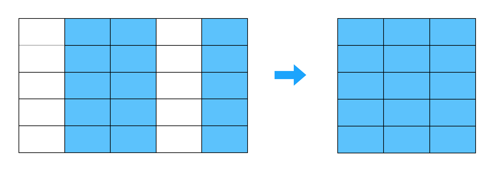
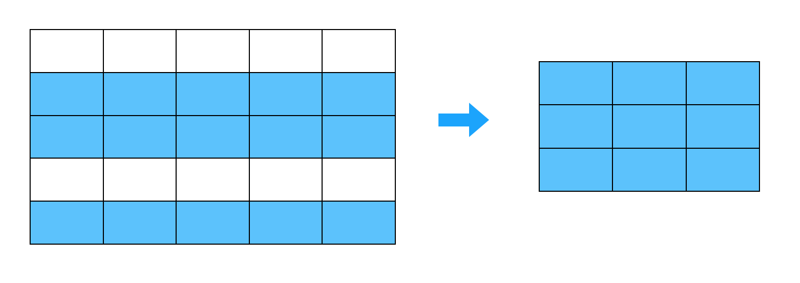
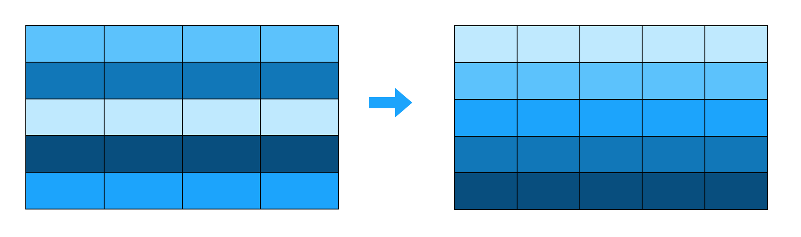
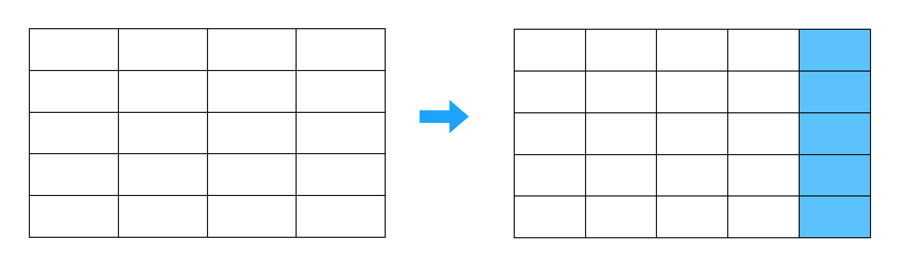
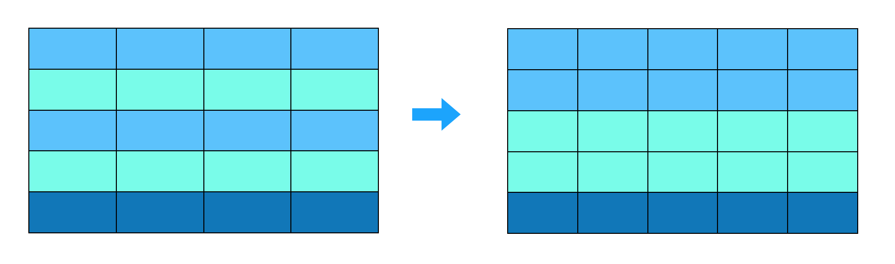
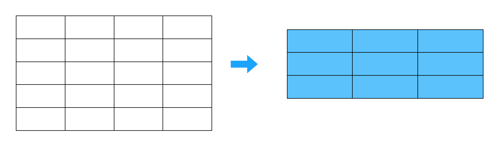

```{r setup, include=FALSE}
knitr::opts_chunk$set(echo = TRUE, fig.align = 'center')
```

# Learning Objectives 

1. Understand conceptually what each `dplyr` verb does
2. Be able to use `dplyr` verbs (`filter`, `arrange`, `select`, `mutate`, `summarise`) to extract a required dataset
3. Be able to deal with missing values and nulls whilst using functions
4. Be able to use additional functions that support the `dplyr` verbs, such as `group_by`, helper functions, window functions and logical operators
6. Be familiar with and able to use the magrittr operator (pipe) to chain together commands

**Lesson Duration: 3 hours 30 minutes**

# Data wrangling

>"Data wrangling is the process of transforming and mapping data from one raw data form into another format with the intent of making it more appropriate and valuable for a variety of downstream purposes such as analytics.  - Wikipedia"

Typically, wrangling data involves taking a dataset, selecting columns you want, filtering rows you want, arranging data by a certain order, adding columns you want, grouping data, and eventually summarising the data you have. 
And while this may seem like a less exciting part of data analysis, it is without a doubt, the part of your data analysis process you'll spend the most time on. In fact, it is said that 80% of a data scientist's job is cleaning and wrangling data. 

```{r, echo=FALSE, out.width = '50%'}
knitr::include_graphics("images/data_wranglign.jpg")
```


# Enter... dplyr 

```{r, echo=FALSE, out.width = '80%'}
knitr::include_graphics("images/dplyr.png")
```


`dplyr` is a package from the tidyverse created for 'data wrangling'. Given the vast amount of time analysts spend wrangling data, the aim of the dplyr package is to provide you will all the tools you need to do this, in one handy package. Each `dplyr` function is known as a **verb**, and `dplyr` aims to provide a function for each basic verb of data manipulation. As a bonus, the verbs (aka functions) have been given names that actually reflect what they do. 


## select() : Include or exclude certain variables (columns)  

```{r, echo=FALSE, out.width = '100%'}

```


## filter(): Include or exclude certain observations (rows)  


```{r, echo=FALSE, out.width = '100%'}

```


## arrange(): Change the order of observations (rows)

```{r, echo=FALSE, out.width = '100%'}

```


## mutate(): Create new variables (columns) 

```{r, echo=FALSE, out.width = '100%'}

```


## group_by(): Create groups of observations

```{r, echo=FALSE, out.width = '100%'}

```


## summarise(): Create summary statistics 

```{r, echo=FALSE, out.width = '100%'}

```


These six functions are known as **single table verbs** because they only operate on one table at a time. Later in the course you will learn two-table verbs that you can use to merge tables together. Although the operations of these functions may seem very simplistic, it’s amazing what you can accomplish when you string them together: Hadley Wickham has claimed that 90% of data analysis can be reduced to the operations described by these six functions. 


# Installing a package

These "verbs" aren't part of R by default - they come from a *package*. The `dplyr` package is installed and loaded as part of the Tidyverse, which you can read more about tonight in a flipped lesson tomorrow. Basically, it's a collection of packages which contain tools for data analysis.

You can think about a package the same way as any piece of software that comes from the internet. Before you can use the software you need to download and install it. 

To install a package we use the function `install.packages`:

```{r, eval = FALSE}
install.packages("tidyverse")
```

We only need to install a package once. Once it's installed we can tell R that we want to use it like this

```{r, message=FALSE}
library(tidyverse)
```

Note

- You only need to do the first step once! Once a package is installed you don't need to install it again. You can think of installing the package as being like downloading and installing RStudio. Once you've done that once you then need only to click on it to open. In a sense, calling the `library()` function is the equivalent of clicking on a program. Here's an [image](https://twitter.com/visnut/status/1248087845589274624?s=20) of an alternative way of thinking about it :

<br>

```{r, echo=FALSE, fig.align='center'}

```


- You need quotes ("") for installing a package, but not for loading it.

- Don't write `install.packages()` into your notebook/script. Always write it directly into the console. If you leave it in, it will try to install the package every time you or someone else runs the script.

## Using a package

Once you've installed a package and loaded the library, all the functions in that library are available for you to use. For example the function `tidyverse_logo()` comes from `tidyverse`.

Let's try this out now. Remember to use your keyboard shortcuts for creating and running a code chunk.

```{r}
tidyverse_logo()
```

Now, let's restart the R session. This "refreshes" R, and will remove all the packages we've loaded in using `library`.

* Go to Session > Restart R

Now try to run the the function again.. 

We have errors because R doesn't know about the two functions any more.

If you only need to use a function or two within a package then you can specify a specific function by using a double colon

```{r}
tidyverse::tidyverse_logo()
```

This time the function will run, even though `tidyverse` isn't loaded, because we specified which package the function was in. 


# The course data package

To avoid having to read in data every single time, we've made a package with some data that we'll be using in the course. You need to install the data package in a slightly different way from usual, because it is stored on GitHub and not on CRAN (the central official hub for R packages). 

Luckily, the installation is still very easy. First you need to install `devtools`.

```{r, eval=FALSE}
install.packages('devtools')
```

Then use the function `install_github()` from the `devtools` package.

```{r, eval = FALSE}
devtools::install_github('codeclan/CodeClanData')
```
```{r}
library(CodeClanData)
```

To use any dataset in the package, you can just call it by name.

```{r}
students
```

# Working with `dplyr`

To demonstrate the power of the six dplyr verbs, we will use them to work with a **Game of Thrones** dataset downloaded from the open data source website kaggle. 

Next, let's have a look at the dataset.  \href{https://www.kaggle.com/mylesoneill/game-of-thrones#character-deaths.csv}{You can find out all about the variables and coding you expect here}  

The data is in the CodeClan data package. Since we loaded the package you should be able to just run:

```{r}
all_deaths
```

to see the data.

# Checking our data 

The first step when working with data is to check what you have. After all, if you don't really understand what data you have, you won't be able to make sense of any summaries, graphs or statistics you produce. We can do this in a few different ways.  

To start with, we can check the size of our data, and the names of our columns.  

```{r}
# number of rows
nrow(all_deaths)

# number of columns
ncol(all_deaths)

# overall dimensions
dim(all_deaths)

# variable names
names(all_deaths)
```


Next we can look at the actual data. To begin, we are going to run the `head` function, which allows us to see the first 6 rows by default. We are going to override the default and ask to preview the first 10 rows, and view the last three rows. 

```{r}
# check the first 10 rows
head(all_deaths, 10)

# check the last 10 rows
tail(all_deaths, 10)
```

Finally, we can look at the data by printing it out in different ways. 

```{r}
# get an overview of the data 
glimpse(all_deaths)

# look at the actual data in table format
view(all_deaths)

# view a short representation of the data
str(all_deaths)

# print the data in the console 
all_deaths
```

So we know we're looking at a tibble, which contains 917 observations and 13 variables.

We can also see we have a lot of `NA` values. These represent **missing values** (i.e. empty values). Missing values are a common issue across all kinds of datasets, and they signify missing or unknown values. Figuring out where they are and what to do with missing values is an important value of data cleaning, which you will learn more about later on. 

# Wrangling with `dplyr` 

## The `select()` function : choosing which variables to keep 


If we wanted to create a data set that included everything but the variable n, we could do this using the `select()` function from the `dplyr` package: 

```{r}
# select a few variables to keep 
select(all_deaths, name, allegiances, gender, nobility, year_of_death) 
```

The first argument to the `select()` function is your tibble, and further arguments are the names of columns you want to keep.   

What if you only want to get rid of one variable? `select()` allows you to do that while saving typing by putting a minus sign in front of the column:

```{r} 
# get rid of the Name column
select(all_deaths, -name) 
```

Note that `select()` (and all the following functions) do not change the original tibble, but make a new tibble. If you don’t assign this new tibble to a variable, it will be printed to the console and not saved anywhere for future wrangling. So if you want to keep it around, assign it to a variable.  

```{r}
deaths_no_names <- select(all_deaths, -name) 
```

  
<blockquote class = 'task'>

**Task - 5 minutes**

1. Select all columns which relate to a book.
2. Select the columns which are related to some kind of death. 

<details>
<summary>**Solution**</summary>

```{r}
# select all columns which relate to a book: different ways
select(all_deaths, -name, -allegiances, -year_of_death, -gender, -nobility)

# There's a few other ways of doing this!
select(all_deaths, book1_GoT:book5_DwD)

select(all_deaths, starts_with("book"))

select(all_deaths, contains("book"))

# select the columns which are related to death.
select(all_deaths, year_of_death, book_of_death)
```

</details>
</blockquote>


# Getting help

Every function (including all the base R functions and functions within packages) has a help file associated with it. Sometimes you might hear this described as looking up the 'docs' or 'documentation' of a function. If you aren't sure how to use a function, you can look up the help file by inserting a question mark before the function name.

```{r, eval = FALSE}
?select
```

Note that you don't need to insert round brackets after the function name: this is because you are not **executing** the function here, you are just using the name of the function.

The help pages for functions can be a little overwhelming if you're not used to reading them. Let's break down the help file for `select()` as an example.

- **Description** - All help files start with a description of the function. Sometimes these can be a little difficult to understand.

- **Usage** - This is one of the most useful parts of a help page. It shows you the function with all the arguments available. 

Arguments **without** an equals sign `=` are mandatory, you have to give them a value.

Arguments **with** an equal sign afterwards are optional, if you don"t specify them they will **default** to the value after the equals sign. 

For an example of a function with a mandatory and non-mandatory argument, try `?mean`.

- **Arguments** - This gives you more detail about the arguments that can be passed into the function: in particular, what type of object they need to be.

- **Details** - This gives extra information about the function. Sometimes this section is very useful.

- **Value** - This tells you what type of object the function will return. 

- **Examples** - This can be the most useful part of the help file. This shows you some examples of the function being used. Sometimes it is  to start with this part of the help file.


## Help for a package

Each package has it's own help page too:

```{r}
help(package = "dplyr")
```

<blockquote class = 'task'>

**Task - 10 minutes**

Using the package `beepr`, get R to play the noise of a fanfare. You will need to read the help files to do this.

<details>
<summary>**Solution**</summary>

```{r, eval=FALSE}
install.packages("beepr")
```

```{r, eval=FALSE}
library(beepr)
beep("fanfare")
```

</details>
</blockquote>


## The `filter()` function: subsetting your data

`filter()` allows you to select a subset of rows in a data frame. Like all single verbs, the first argument is the tibble (or data frame). The second and subsequent arguments refer to variables within that data frame, selecting rows where the expression is TRUE.

First let's see an example:

```{r}
# let's pick out one house of characters:
filter(all_deaths, allegiances == "Lannister")
```

This returns the rows of the data frame, where the `allegiances` column is "Lannister". The `==` symbol an example of a **logical operator**. These are special symbols check how two things are related.

### Logical Operators

1. `==` tests if two things are equal.

2. `!=` tests if two things are not equal.

3. `<` tests if the left is *less than* the right.

4. `>` tests if the left is *greater than* the right.

5. `<=` tests if the left is *less than or equal to* the right, `>=` tests for *greater than or equal to*.

6. `%in%` tests if the left is contained in the right.

The easiest way to see how these operators work is by example.

We've already seen all the rows there the allegiance is "Lannister", now let's see all the rows where the allegiance **is not** "Lannister".

```{r}
filter(all_deaths, allegiances != "Lannister")
```

What if we have more than one way of writing Lannister? Then we'll need to use the `%in%` operator. We join multiple things together with brackets and a `c`.

```{r}
filter(all_deaths, allegiances %in% c("House Lannister","Lannister"))
```

If we have a numeric a column we can do things like:

```{r}
filter(all_deaths, year_of_death > 299)
```

This shows us characters who died after the year 299. Note, if we did `>=` we'd get a different answer.

```{r}
filter(all_deaths, year_of_death >= 299)
```

This shows characters who died in the year 299 **or higher**.

Make sure you are clear about the type of your column. When describing things from text columns you must use quotes. But you do not use quotes for numeric columns. For example, the column `gender` is numeric so this works:

```{r}
filter(all_deaths, gender == 0)
```

But the column `allegiances` is a character column, so this *does not* work.

```{r, eval = FALSE}
filter(all_deaths, allegiances == None)
```

We must have "None" in quotes.

```{r}
filter(all_deaths, allegiances == "None")
```

### Not / and / or

We have an extra set of logical operators, which effect how other logical operators work.

1. `!` NOT - negates the operator after i.e. does the opposite.
2. `&` AND - only returns rows when both sides are true.
3. `|` OR - returns rows when either side is true.

Let's see an example. If we want noble Lannister characters, then we need to do this:

```{r}
filter(all_deaths, allegiances == "Lannister" & nobility == 1)
```

If we want either Lannisters or Starks we need to do this:

```{r}
filter(all_deaths, allegiances == "Lannister" | allegiances == "House Stark")
```

How about people who were introduced between chapters 5 and 10? We could do this:

```{r}
filter(all_deaths, book_intro_chapter >= 5 & book_intro_chapter <= 10)
```

<blockquote class = 'task'>

**Task - 5 minutes**

1. Find where the `year_of_death`is less than or equal to 299. 
2. Find the females (gender is 0) who are not Lannisters
3. Find just the data for the characters "Jon Snow", "Daenerys Targaryen" and "Samwell Tarly".

<details>
<summary>**Solution**</summary>

```{r}
# Find where the `year_of_death`is less than or equal to 299. 
filter(all_deaths, year_of_death <= 299)

# Find the females who are not Lannisters
filter(all_deaths, allegiances != "Lannister" & gender == 0)

# Find just the data for the characters "Jon Snow", "Daenerys Targaryen" and "Samwell Tarly".
filter(all_deaths, name == "Jon Snow" | name == "Daenerys Targaryen" | name == "Samwell Tarly")
# alternatively
filter(all_deaths, name %in% c("Jon Snow", "Daenerys Targaryen", "Samwell Tarly"))
```

</details>
</blockquote>

## The `arrange()` function: putting your data in order
<br>

`arrange()` works similarly to `filter()` and `select()` except that instead of filtering or selecting rows, it reorders them by column names. 

```{r}
# arrange it so all the females (gender = 0) come first 
arrange(all_deaths, gender)
```

The default is to sort in ascending order. If we want it descending, we wrap the name of the variable in the `desc()` function.   

```{r}
arrange(all_deaths, desc(book_of_death))
```

We can sort by more than one column. For instance, we can first sort by book of death, and break ties using chapter of death.

```{r}
arrange(all_deaths, book_of_death, death_chapter)
```

<blockquote class = 'task'>

**Task - 5 minutes**

1. Arrange `all_deaths` by `allegiances`. What happens when you arrange by a character column?
2. Arrange `all_deaths` by `allegiances` and `book_intro_chapter`
3. Arrange `all_deaths` by descending `year_of_death`

<details>
<summary>**Solution**</summary>

```{r}
# arrange `all_deaths` by `book_of_death`
arrange(all_deaths, allegiances)
# It arranges in alphabetical order!

# arrange `all_deaths` by `allegiances` and `book_intro_chapter`
arrange(all_deaths, allegiances, book_intro_chapter)

# arrange `all_deaths` by descending `year_of_death`
arrange(all_deaths, desc(year_of_death))

```

</details>
</blockquote>


## The `mutate()` function: creating new variables (columns)

Besides selecting sets of existing columns, it’s often useful to add new columns that are functions of existing columns. 

This is the job of `mutate()`. Let's use it to calculate the number of years people survived in the book series, after the year 298. 

```{r}
# create a new variable called years_survived, which calculates the year of death, minus the year 298. 
mutate(all_deaths, years_survived = year_of_death - 298)
```

What about changing an existing column? Well, you use `mutate` for that too! If you create a column with the same name as an existing column it will be overwritten.

Let's change `book_of_death`, so that it is multiplied by 5. Why do this? Why not!

```{r}
mutate(all_deaths, book_of_death = book_of_death*5)
```

Although, note that we haven't changed the dataset `all_deaths`, we'd need to overwrite `all_deaths` to do that.

Mutating columns is very useful. When you are doing data cleaning a lot of the time you will be changing your columns and this always uses mutate.

### Functions

Often, you will be changing a column by using a *function*. A function is anything that takes one or more inputs and gives you back an output. For example the `sum()` function we used above takes a vector as input and gives back a single number as output. 

Often programmers talk about a function 'returning' something. This is just the same as saying the function 'gives back' an output. The `sum()` function contains R code that converts between the input and the output, but we don't need to see the code to understand what `sum()` does. 

You can apply many different functions to vectors. Some useful ones we will use include.

1. `is.na`

This checks for missing values, and returns `TRUE` when we have a missing value and `FALSE` otherwise.

```{r}
mutate(all_deaths, year_of_death = is.na(year_of_death))
```

2. The conversion functions: `as.integer`, `as.double` `as.numeric`, `as.character`, `as.factor` and `as.logical`.

These functions take a variable of one type and - if it's possible - convert it into another type. For example

```{r}
mutate(all_deaths, book_of_death = as.character(book_of_death))
```

* There isn't much to see here, but the type of book of death has changed!

It's not always possible to convert. How would you change names into numbers?

```{r}
mutate(all_deaths, name = as.numeric(name))
```

R is not sure, so it just gives you missing values back.

3. `sum()` 

Adds up all the elements of a column and returns the total. If you have any missing values in the sum, then the answer will be `NA`. To avoid this behaviour set `na.rm = TRUE` inside the function.

```{r}
mutate(all_deaths, year_of_death = sum(year_of_death, na.rm = TRUE))
```

This function is a bit different from the other two we have seen so far. It returns one number as a summary, so our answer is the same for every row in the data frame.


4. `mean()` 

This function is like sum, as it returns just one value. This time we find the average value.

```{r}
mutate(all_deaths, year_of_death = mean(year_of_death, na.rm = TRUE))
```

Again we need to use `na.rm = TRUE`.

<blockquote class = 'task'>

**Task - 5 minutes**

1. Add a new column which is a logical vector, which has TRUE if `book_intro_chapter` is empty, and FALSE if it isn't. *Hint: you'll need to use the `is.na` function*. 
2. Change the nobility column to a logical vector. 
3. Find the number of male characters by taking the sum of the `gender` column (as `gender = 1` is male).

<details>
<summary>**Solution**</summary>

```{r}
# Add a new column which is a logical vector, which has TRUE if `book_intro_chapter` is empty, and FALSE if it isn't
mutate(all_deaths, has_no_intro_chapter = is.na(book_intro_chapter))

# Change the nobility column to a logical vector
mutate(all_deaths, nobility = as.logical(nobility))

# Find the number of male characters by taking the sum of the `gender` column.
mutate(all_deaths, n_males = sum(gender))
# We'll see a better way of doing this soon!
```

</details>
</blockquote>

## The `summarise()` function: summarise your table 

One of the final important things to learn is how to summarise important aspects of your data. Summarise is typically used on grouped data, created by the `group_by` function. When used together, the `summarise` function collapses each group into a single-row summary of that group.

We can't use `summarise` by itself. It is always used together with functions like `sum`, that make summary values and calculate of value that in some way *summarises* those value.

Like `mutate`, we have to give a new column name.

```{r}
summarise(all_deaths, n_males = sum(gender))
```

Remember that `dplyr` always takes in data frames and returns data frames. So even though we only have one value we still have a data frame!

But it's much more common to use `summarise` with `group_by`. This gives us summaries for each "group".

For example: 
<br>
```{r}
# group the death data by Allegiances
deaths_grouped <- group_by(all_deaths, allegiances)

# now count the number of people in each group using the n() function
summarise(deaths_grouped, character_count = n())

# Also - you can use `summarise` or `summarize` - works both ways!
```

The `n` function here counts the number of observations within the group you've made. It can only be used within `summarise`, `mutate`, and `filter`. In the example above, we have grouped our data by `allegiances`, and so the `n()` function in this case will count how many people are in each group (i.e. how many in each house).  

Here we have only grouped by one thing, but the `group_by` lets you group by more than one variable, so you can summarise in lots of different ways! Here's an example of grouping by more than one variable

```{r}
deaths_grouped <- group_by(all_deaths, nobility, gender)
summarise(deaths_grouped, character_count = n())
```

Every time you summarise you remove *one layer of grouping*. So in our example above we've removed the `gender` grouping, but not the `nobility` grouping. To remove all the groupings we need to use the `ungroup` function.

<blockquote class = 'task'>

**Task - 10 minutes**

Now it's your turn! Start with the `all_deaths` data. 

If a character doesn't have a missing value for `book_of_death`, this means that they have died at some point. Use this to find the allegiances with the highest number of people dead.

**Hint** 
You will need to:

1. Filter the data so we just have characters who have died.
2. Use group by and summarise to find the number of characters who belonged to each allegiance.
3. Arrange so the highest values come first.

<details>
<summary>**Solution**</summary>

```{r}
# 1. Filter the data so we just have characters who have died.
have_died <- filter(all_deaths, !is.na(book_of_death)) 

# 2. Use group by and summarise to find the number of characters who belonged to each allegiance.
died_grouped <- group_by(have_died, allegiances)
died_counts <- summarise(died_grouped, count = n())

#3 . Arrange so the highest values come first.
arrange(died_counts, desc(count))
```

</details>
</blockquote>

# Pipes: creating sequences of multiple operations. 


>"Pipes: at first you'll probably hate them, but once you get the hang of them you'll love them." - Everyone who has learned pipes in R. 


The pipe, `%>%`, comes from the `magrittr` package by Stefan Milton Bache. It is designed to allow you to create sequences of operations, without having to create lots and lots of datasets in between. Packages in the tidyverse load `%>%` for you automatically, so you don’t usually load magrittr explicitly.

As you can see above, the `dplyr` functions don't save new datasets every time you do something. Therefore we had to do a lot of assigning, as we stepped through the different ones. Ideally, you don't really want to have lots of different datasets clogging up your environment: not only does it take up a lot of space, but it also becomes harder and harder to remember which datasets are what (even if you've named them well). 

Enter, the pipe. 

Let's look at the code we used above to get a summary: 

```{r}
have_died <- filter(all_deaths, !is.na(book_of_death)) 

died_grouped <- group_by(have_died, allegiances)
died_counts <- summarise(died_grouped, count = n())

arrange(died_counts, desc(count))
```


Now, let's look at the pipe version of that code:

```{r}
all_deaths %>% 
  filter(!is.na(book_of_death)) %>% 
  group_by(allegiances) %>% 
  summarise(
    count = n()
  ) %>% 
  arrange(desc(count))
```

Can you see how the two outputs end up being the same? Pipes can be hard to read at first, but once you get the hang of them, they become much more intuitive than regular non piped code.

<div class='emphasis'>
The best way to understand a pipe is to translate `%>%` to the words "and then...". 
For example, by doing this you can read this pipe code from top to bottom as follows:

* Take the data `all_deaths` *and then*
* Filter the rows that have missing values *and then*
* Group the data by allegiances *and then*
* Summarise to find the count in each allegiance *and then*
* Arrange so that the highest counts come first.

</div>


Overall, using pipes eliminates the need to create and store lots of datasets, makes the code easier to read, and makes the code more efficient to write. Which is good, as the two main aims pipes were designed for were: “to decrease development time and to improve readability and maintainability of code.” 

# Pull

Let's say we have been asked the following question: 

*'Calculate the average year of death and create a new column which states TRUE if the year of death for the character is above this average (and FALSE if not).'*

First thing is we want to calculate the average year of death. We can use `summarise` using the `mean()` function as the aggregate function. 

```{r}
average_year_of_death <- all_deaths %>%
  summarise(average_value = mean(year_of_death, na.rm = TRUE))

average_year_of_death
```

Now let's use `mutate()` to create a new column. We want to create a condition to check if the `year_of_death` column value is greater than this value `average_year_of_death`. 

```{r, eval = FALSE}
all_deaths %>%
  mutate(death_later_than_average = year_of_death > average_year_of_death)
```

On no, don't get anything returned, it hasn't worked! Let's understand why this hasn't worked. Let's check if we hard code the value `299` (that we got for the average) into our code, does it work?

```{r}
all_deaths %>%
  mutate(death_later_than_average = year_of_death > 299)
```

Yes that gives us what we were after. So something is not working out with using `average_year_of_death` that we created. First let's check what type of object `average_year_of_death` is:

```{r}
class(average_year_of_death)
```

It's a tibble. What type is 299?

```{r}
class(299)
```

It's numeric. So the object `average_year_of_death` is a tibble, which has 1 column called `average`, and not a number, and so we can't use it in our condition. There are 2 ways for us to get to the underlying vector (which in our case is a numeric vector of length 1) to use in our condition. First option is to use the function `pull()` in our pipe: 

```{r}
average_year_of_death <- all_deaths %>%
  summarise(average_value = mean(year_of_death, na.rm = TRUE)) %>%
  pull()

average_year_of_death
```

We can see already from the layout of the output this is no longer a tibble, but let's check to confirm:

```{r}
class(average_year_of_death)
```

Great, we should now be able to use this in our condition. 

```{r}
all_deaths %>%
  mutate(death_later_than_average = year_of_death > average_year_of_death)
```

Great, this has worked how we wanted! 

The second option, which you may see quite frequently in base R code, is the `$` symbol. It's works equivalently to `pull()` but can be handy if you don't want to include `pull()` in your pipe. 

To demonstrate `$` let's create our tibble version again: 

```{r}
average_year_of_death <- all_deaths %>%
  summarise(average_value = mean(year_of_death, na.rm = TRUE))
```

Now we use this tibble in the condition but we use the `$` symbol to pull out the single vector which we have named `average_value`:

```{r}
all_deaths %>%
  mutate(death_later_than_average = year_of_death > average_year_of_death$average_value)
```

Again, this has worked how we had hoped! The logic for both `pull()` and `$` hold even if the vector is longer than 1 entry (but in our case it is just 1x1). 