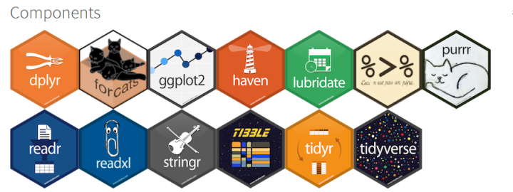
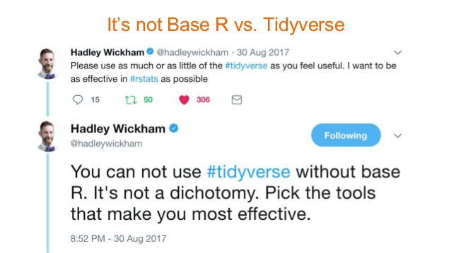

```{r setup, include=FALSE}
knitr::opts_chunk$set(echo = TRUE, fig.align = 'center')
```

  
# Learning Objectives  

1. Know what tidyverse is
2. Know what some of the differences between base R and tidyverse are
3. Know what all the tidyverse packages are used for

**Lesson Duration: 20 minutes**

# What is Tidyverse?  

```{r, echo=FALSE, out.width = '100%'}

```

  
The Tidyverse is actually more than just a package, it is a collection of packages which contain lots of different tools to perform data analysis. The tidyverse is very widely used for data ‘wrangling’ amongst other tasks. By data wrangling we mean preparing data to be used in analysis tasks. 

Tidyverse was created by world-famous data scientist Hadley Wickham (@hadleywickham), with the aim to provide all the tools you need to clean, reorganise and prepare data under one roof. Tidyverse packages are intended to make statisticians and data scientists more productive by guiding them through workflows that facilitate communication, and result in reproducible work products. Fundamentally, the tidyverse is about the connections between the tools that make the workflow possible.

<br>
\pagebreak 

## What does Tidyverse contain?


Tidyverse contains 8 different 'core' packages. Within these core packages, you should be able to find everything you need to analyse your data.

* `ggplot2` : for plotting all your data
* `dplyr` : for data manipulation
* `tidyr` : for creating tidy data 
* `readr` : read rectangular data files (e.g. csv, tsv)
* `purr`  : for working with functions and vectors
* `tibble` : the modern version of a data frame
* `stringr` : for working with strings (text data)
* `forcats` : for use with factors


```{r, echo=FALSE, out.width = '100%'}

```


These eight packages are considered the “core” of the tidyverse as they are the most used tidyverse packages, and are often used in combo with one another. They are also the ones automatically loaded when you load in the tidyverse library.   

There are also several accompanying packages that don't count as 'core' packages, but which can be used alongside the tidyverse ones to create even more powerful data analysis combinations. You can list all of the tidyverse packages by doing this:  

<br> 

```{r, warning=FALSE, message=FALSE}
library(tidyverse)
tidyverse_packages()
```


Another tip: Tidyverse packages are maintained and updated frequently, so it helps to check if updates are available. You can do this by running `tidyverse_update`.   


# What does each Tidyverse package do?

<br>
Tidyverse is all about data cleaning and data analysis. You can see each package grouped by which function they perform, here:    

```{r, echo=FALSE, out.width = '100%'}
knitr::include_graphics("images/tidyverse1.png")
```


# Why use Tidyverse?

## Simplicity

R is not the easiest programming language to master: often times the syntax can be confusing, and the many functions available aren't always designed to work together or on similar data types. The Tidyverse introduces a set of useful data analysis packages to help streamline your work in R. Importantly, the collection of packages were designed to **"share an underlying design philosophy, grammar, and data structures" of tidy data. This, in theory, makes it easy to combine different tools across packages whilst maintaining a reproducible, understandable and clear workflow when analysing data. 

<br>

## Structure consistency 

Tidyverse maintains consistent formatting across it's data storing and functions.   

For example, the functions within tidyverse all follow the same structure: 

```{r, eval = FALSE}

function(.data, ..., extra arguments)

```

The first formal argument is always the data, followed by additional arguments needed to use that function. Knowing that all tidyverse functions follow the same pattern allows you to quickly use lots of different functions within it. 

## Output consistency  

Having a consistent function structure and data input style also means that results obtained from tidyverse are more consistent, whereas results from a base R function often depend on the type of data being used. 

<br>

## Formatting

All the tidyverse functions use `snake_case`, which helps enormously when coding. `snake_case` just means that you type in lower case, and separate words with an underscore `_`. This makes typing quicker, and means that there is a consistent style across functions and code.   

 
## One workflow: one package idea

Tidyverse was designed to provide one place to download all the functions you would need for many different types of end-to-end data analysis projects in one source. This idea provides an appealing starting point for data analysts: if you use tidyverse, theoretically you should have everything you need in one package.


# Tidyverse AND Base R

The R functions that are not in a library are often called "base R". Many of the things you can do using the tidyverse can be done in base R. It's important to know that it's not a case of tidyverse vs. base R. The two are used in combination and often times compliment each other. 

```{r, echo=FALSE, out.width = '100%'}

```


Some of the differences are:

1. The tidyverse functions are faster than R base functions when loading in large files.   

2. Tidyverse functions automatically convert variable types when importing data into R.  

3. If you have missing variable names, tidyverse will rename these as - for example - `X1`, whereas base R will rename them as - for example - `X.1`.   

4. Tidyverse makes use of `tibbles` instead of `data_frames`. A data frame is a base R object. Data frames can hold vectors of different types, e.g. numeric, character, and categorical data can be stored together. Tibbles are newer, tidyverse versions of `data.frames` with nicer behaviour around printing, subsetting, and factor handling (tibbles as aimed to data manipulation).   
    a. Tibbles have nice printing method that show only the first 10 rows and all the columns that fit on the screen - which is more apparent in .R scripts vs .Rmd files. They also show the data types you're working with. This is useful when you work with large data sets.
    b. When you subset a tibble, for example selecting a single column from a tibble, you get a 1D tibble, rather than a vector of say character or numeric (etc.) type. When you subset a dataframe you will get a vector of character or numeric (etc.) type. To get the underlying vector from a tibble you can use the methods described in the dplyr lesson e.g. `pull()` and `$`.  


