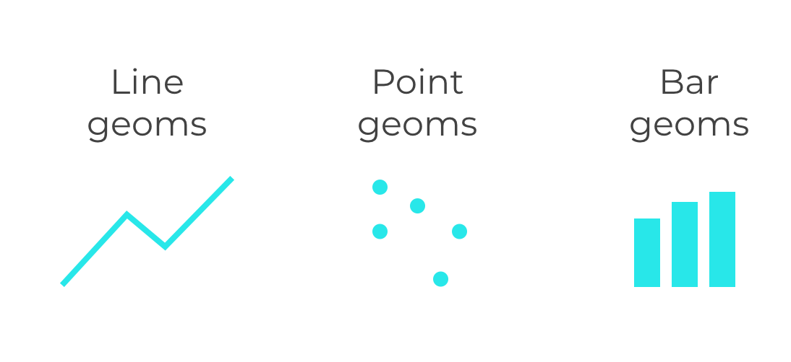

  
```{r setup, include=FALSE}
knitr::opts_chunk$set(echo = TRUE, fig.align = "center")
library(tidyverse)
```

# Learning Objectives<br>
* Understand the importance of **good** data visualisation
* Understand the basics of the "grammar" of graphics
* Know how to create basic plots in `ggplot2`
* Know how to build plots with layers

**Duration - 2 hour 30 minutes**<br>


<br>

# What is Data Visualisation?

Data visualisation is a key term in data science that you may already be familiar with. A common definition would be:

> Data visualisation is the graphical representation of information and data. By using visual elements like charts, graphs and maps, data visualisation tools provide an accessible way to see and understand trends, outliers and patterns in data. In the world of data, data visualisation tools and technologies are essential for analysing massive amounts of information and making data-driven decisions.

<br>

In essence, data visualisation is the process of taking data and translating and communicating it in graphical form. Humans are exceptionally good at processing and recalling visual data. Long lists of numbers and big blocks of text - less so. So we can use visualisation to better understand the data we work with, and we can also use it to communicate data to others.

<br>

# Why is data visualisation so important? 

Take a look at the graphs below. 

<br> 
<blockquote class='task'>
**Task - 2 mins** 
Do you think this graph works well as an explanatory graph? How could it be improved?

```{r, echo=FALSE, out.width = '100%'}
knitr::include_graphics("images/complicated-chart.png")
``` 

<details>
<summary>**Answer**</summary>

No, it's far too complicated. For so many reasons. Needs to focus on a few ideas and present the data in a clear way.  

</details>
</blockquote>
<br>

From the above chart, you can probably see why good data visualisation is both extremely hard, and extremely important. There are some general guidelines to follow when creating informative plots: 

  * Have clear axis labelling, legends and titles  
  * Don't truncate axis so they start or end in misleading places  
  * Representation of numbers should match the true proportions (i.e. make sure your numbers add up)  
  * Design should be simple: don't add colours where you don't need them, and don't add visual deceptions like white space that don't correspond to the data.
  * Make sure you use the appropriate graph: don't use a series of bar graphs when one line graph would be clearer  
  * Provide the context necessary to understood in the chart - show the relevant comparison(s)
<br>


Yes, it seems like some of these are rudimentary graphing skills — but you'd be amazed at how many people manage to miss them (especially when using R, as you have to generally add them separately).  
And this all brings us to something called.... 

## Data-to-ink ratio 

Edward Tufte (who is seen as a pioneer in the field of data visualisation) introduced the concept of data-ink ratio. 

The data-ink ratio is the proportion of ink that is used to present actual data compared to the total amount of ink (or pixels) used in the entire display. And we want to aim to maximise the data-ink ratio, within reason of keeping that which makes it easier for the audience to understand the visual. 

[This](https://www.darkhorseanalytics.com/portfolio/data-looks-better-naked-bar-charts) is a great step through of removing 'chart junk' (i.e. elements in charts and graphs that are not necessary to comprehend the information represented on the graph, or that distract the viewer from this information).

We want to keep this principle of simplicity and removing distraction when building visuals.


Now we know what we don't want, let's get started.  
<br> 

# Using `ggplot2`  
<br>

`ggplot2` is an R package (part of the `tidyverse`) that enables you to create data visualisations. You can use it to create everything from simple bar graphs all the way up to detailed maps. It can take a while to get your head around how it works, however once you understand it I'm sure you'll find `ggplot2` very powerful.


## `ggplot2` "grammar"

<br>
There are four main parts of the basic `ggplot2` call: 


```{r, echo=FALSE, fig.cap="image from sharpsightlabs.com", out.width = '80%'}

```

<br> 

  * You start with the function `ggplot()`. This initiates plotting. That's all it does. Within this function you include the data you are plotting. 
  * Next is the `aes` function. This allows you to choose which parts of your data you are going to plot. More precisely, the `aes()` function allows you to map the variables in your data frame to the aesthetic attributes of the geometric objects of your plot.
  * You then add on the type of plot you want using the `+` call.  
  * Finally, you call different a specific function for the plot you want. For example, if you wanted a bar chart, you would next call `geom_bar()`. More precisely, these are called the `geoms` of the plot: short for the geometric shapes you'll use. Lines, points, and bars all all types of geoms. This will become clearer once you start using it more.  
<br>

```{r, echo=FALSE, fig.cap="image from sharpsightlabs.com", out.width = '80%'}

```
<br> 

And that's pretty much it! You can build commands on top of each other so that you can produce more and more complex plots, but ultimately you just need this simple starting block and can repeat syntax. This syntax flow is highly structured. This is where thes name 'ggplot' comes from: is short for 'grammar of graphics plot'. Similarly to the structure of grammar, `ggplot2` has a consistent and structured workflow. This structured nature of `ggplot2` is one of its best features.

<br>

<blockquote class='task'>
**Task - 2 mins** 
  
```{r, echo=FALSE, out.width = '100%'}

``` 

Identify the geometric objects and aesthetic mapping used in each of this plots.

<details>
<summary>**Answer**</summary>

* Geoms: Lines! 
* Aesthetics: x = year, y = intake, colour = food type  

</details>
</blockquote>

<br>

## Using `ggplot2()`  


As ggplot is part of tidyverse you should already have it installed. To begin we will begin by looking at some student survey data taken from an international census. So let's load in tidyverse and the data...

```{r, message=FALSE, warning=FALSE}
library(tidyverse)

students <- read_csv("data/students.csv")
```

Let's take a look at a first 10 rows of our data to see what information we have in our data.

```{r}
head(students, 10)
```

We will plot the preferred superpowers from our dataset.   

1. The data we use is `students`.
2. We want to make a bar chart, so we need bars as our geometric objects.
3. We want to map the type of superpower to the x position of the bars. 

Translating this into ggplot syntax gives us:

```{r}
ggplot(students) +
  geom_bar(aes(x = superpower))
```
<br>

So the first call is always to `ggplot()` and the first argument is always the dataset. Next, we include the type of geom we want `geom_bar`, along with the `aes()` terms we want. In our case, we are plotting `superpower` on the x axis.  

You might be wondering why we don't have anything specified for the y axis? In this case, it is because `geom_bar()` is programmed to automatically count the data within your chosen variable (here, `superpower`) as bar graphs display frequency or count data. Although it is basic, it's a semi-decent graph in just two lines of code.  


### Inside `aes` and outside `aes`.

<br>

Say we want to colour the bars in. This colouring doesn't depend on a specific variable from the data, so it goes **outside** `aes`.  

```{r}
ggplot(students) +
  geom_bar(aes(x = superpower), fill = "light blue")
```


**Note**, there are 2 colour arguments `fill` and `colour` - `fill` defines the colour with which a geom is filled, whereas `colour` defines the colour with which a geom is outlined. Both `colour` and `fill` can be used in or outside the `aes`. 

```{r}
ggplot(students) +
  geom_bar(aes(x = superpower), fill = "light blue", colour = "red")
```


You can also colour your bars by **variables in the data**. Let's say we want to colour the bars in by the year each student is in. We can do this by setting fill to be mapped the school year, **inside** `aes`.

```{r}
ggplot(students) +
  geom_bar(aes(x = superpower, fill = school_year))
```
<br> 

Looking fine. But what if you hate the default colours? No problem, we'll be learning about colours and themes this afternoon which will allow us to customise the plot. 


## Position adjustments

When you make a bar chart with fill, by default the bars are stacked on top of each other as above. But we can change this by changing the position argument in `geom_bar`. We can use `position = "dodge"` to change the bars to be side by side.

```{r}
ggplot(students) +
  geom_bar(aes(x = superpower, fill = school_year), position = "dodge")
```
<br> 
Or `position = "fill"` to make each bar the same height, and let the colour show the relative proportions. 

```{r}
ggplot(students) +
  geom_bar(aes(x = superpower, fill = school_year), position = "fill")
```


This graph is beginning to look better, and hopefully it is clear that you can start with a basic plot in `ggplot2`, and continually add and tweak different parts of it in order for it to look how you want it.  

## Statistical transformations

As we said above, the default `geom_bar` is actually doing a statistical transformation for us: it's counting the number in each group and using that to make the bar. This is the "count" statistic in `ggplot2`, if you specify `stat = "count"` in `geom_bar` our plot will look the same (as this is the default, can see this from the help file `?geom_bar`).

```{r}
ggplot(students) +
  geom_bar(aes(x = superpower, fill = school_year), stat = "count")
```
<br>

But what if we have data where the counting has already been calculated? For this, let's create some a count column in our data:   
<br>

```{r}
count_data <- students %>% 
  group_by(superpower, school_year) %>% 
  summarise(counts = n())
```


If you try to plot this as it is, you'll get an error:

```{r, eval = FALSE}
# try with no count used
ggplot(count_data) +
  geom_bar(aes(x = superpower, y = counts, fill = school_year))
```


This is because it doesn't know what to do if you've already got count data. In this case, we need to specify that we use no statistical transformation in `geom_bar`. We do this by setting `stat = "identity"` which translates to: plot the data as is. 

```{r}
ggplot(count_data) +
  geom_bar(aes(x = superpower, y = counts, fill = school_year), stat = "identity")
```

Alternatively, you can use `geom_col`, which is the same as `geom_bar` but with no statistical transformation by default.  

```{r}
ggplot(count_data) +
  geom_col(aes(x = superpower, y = counts, fill = school_year))
```


## Labels

Labels are also an important part of making our plots easy to understand. R will fill in labels based on the names from the data, by default. However, you will often want to overwrite these using `labs`. You can specify the `xlab` and `ylab`, for the x and y label. You can add a title and subtitle with `title` and `subtitle` respectively. Also you can change the title of any legend, by giving the aesthetic name.

If you want to add more space (or split text over multiple lines) you can include a newline indicator: `\n`.

```{r}
ggplot(students) +
  geom_bar(aes(x = superpower, fill = school_year)) +
  labs(
    x = "\nSuperpower",
    y = "Count",
    title = "Preferred Superpower by School Year",
    subtitle = "Data from students around the world\n",
    fill = "School Year"
  ) 
```

Note that you can use the `xlab`, `ylab`, and `ggtitle` functions instead:

```{r}
ggplot(students) +
  geom_bar(aes(x = superpower, fill = school_year)) +
  xlab("\nSuperpower") +
  ylab("Count") +
  ggtitle("Preferred Superpower by School Year",
          subtitle = "Data from students around the world\n") +
  labs(fill = "School Year") 
```


And there you have a plot that is at least informative and accurately displays the data.  


<blockquote class='task'>
**Task - 10 mins** 

Now it's your turn.

Let's load in data about Olympics medals. 

```{r, message = FALSE}
olympics_overall_medals <- read_csv("data/olympics_overall_medals.csv")
```

Subset the `olympics_overall_medals` data to show the top 10 countries with the most gold medals at the summer Olympics. 

```{r, message = FALSE}
top_10 <- olympics_overall_medals %>%
  filter(season == "Summer", medal == "Gold") %>%
  arrange(desc(count)) %>%
  top_n(10)

top_10
```
<br> 

Create an informative plot that plots the count of medals by team. **Write down an explanation of what the plot shows**.    

<details>
<summary>**Answer**</summary>

```{r}
ggplot(top_10) +
  geom_bar(aes(x = team, y = count), fill = "gold", stat = "identity") +
  labs(
    y = "Number of Medals",
    x = "Team",
    title = "Top 10 teams for all time Gold Meal count for Summer Olympics"
  )
```

The plot shows that United States is a clear winner in terms of the most gold medals in the summer Olympics. Soviet Union comes in second, closely followed by Germany. 

You may be wondering how we can order this graph from highest to lowest count, this is something we will be covering later today. 

</details>
</blockquote>


# Layers
<br>

Plots in `ggplot` (like ogres) have layers. The bar plots we created above is only a single layer, but in `ggplot2` you can build up plots with many geoms.

Let's have an example. We have a lot of chickens, and 4 types of chicken feed. The chickens are split into 4 groups, each group is fed one of these type of feed, and each chicken is weighed regularly. We want to show how the weights of these chickens increase over time.

Below is an example of a one-layer `ggplot` that visualises our chicken data. `ChickWeight` is an in-build dataset available in Base R. We can load this in and fix the variable names so they conform to our coding standard. 

```{r}
library(janitor)

chick_weight <- clean_names(ChickWeight)

head(chick_weight)
```


```{r}
ggplot(chick_weight) +
  geom_line(
    aes(x = time, y = weight, group = chick, colour = diet))
```
<br> 

Our first layer shows how chicken weights change over time, on different types of diets, in the form of **lines**.  Now we add a second layer which identifies the actual observations. This one will use **points** as it's geometric object. The structure of the call is very similar to the first layer.
<br>

```{r}
ggplot(chick_weight) +
  geom_line(aes(x = time, y = weight, group = chick, colour = diet)) +
  geom_point(aes(x = time, y = weight, colour = diet))
```

<br>
Now we have our individual observations and our lines.  We can add a final layer we add a smoothed trend line and confidence band for each group. These statistics are automatically calculated by the `geom_smooth()` function. You can alter the method used with the argument "method" - see `?geom_smooth` for details.

*Note: the `alpha` argument sets the transparency of the geoms you are plotting*  
```{r, warning = FALSE, message = FALSE}
ggplot(chick_weight) +
  geom_line(
    aes(x = time, y = weight, group = chick, colour = diet),
    alpha = 0.25
  ) +
  geom_point(
    aes(x = time, y = weight, colour = diet),
    alpha = 0.5
  ) +
  geom_smooth(
    aes(x = time, y = weight, colour = diet)
  )
```
<br>


So now we have one plot, with three layers. However, there is some redundancy in this code. We are using the same aesthetics for almost every layer. Any aesthetics that apply to every layer can be placed either inside `ggplot` or just after.
<br>

```{r, warning = FALSE, message = FALSE}
ggplot(chick_weight) + 
  aes(x = time, y = weight, colour = diet) +
  geom_line(aes(group = chick), alpha = 0.25) +
  geom_point(alpha = 0.5) +
  geom_smooth()
```
<br>
This shows how powerful `ggplot` is: with the same syntax, you can add multiple layers to your plots easily.  

<br>


<blockquote class='task'>
**Task 1 - 10 mins** 
 
Go back to using the `students` dataset: 

1. Use `geom_point` to make a scatter graph, with the height of students on the x-axis and their reaction time of the y axis.

2. Make all the points blue. For `geom_bar`, the colour of the bar is controlled by `fill`, but for `geom_point` the colour of the points are controlled by `colour`.

3. Make the colour of the points depend on the `superpower` the student wishes they had. 

4. Write down what the graph tells you overall.  

<details>
<summary>**Answer**</summary>

1.
```{r}
ggplot(students) +
  geom_point(aes(x = height_cm, y = reaction_time))
```

2.
```{r}
ggplot(students) +
  geom_point(aes(x = height_cm, y = reaction_time), colour = "blue")
```

3.
```{r}
ggplot(students) +
  geom_point(aes(x = height_cm, y = reaction_time, colour = superpower))
```

4. There doesn't seem to be much of a relationship between height and reaction type. 
</details>

</blockquote>
 
 
 
<blockquote class='task'>
**Task 2 - 10 mins** 
 
Let's load the dataset `pets`:  

```{r, message = FALSE}
pets <- read_csv("data/pets.csv")
```

 
Create a labelled scatter plot, of pet age vs. weight, with the following 5 mapping/aesthetics. For items 3-5 you may want to look at the help file of `?geom_point` and read about different aesthetics:

1. We want age of the x-axis and weight on the y axis
2. We want the points the be different colours depending on the gender of the pet  
3. We want different shapes depending on the type of animal
4. We want all the points to be bigger than normal (size 4).
5. We also want labels with the pets names next to every point.

<details>
<summary>**Answer**</summary>
  
```{r}
ggplot(pets) + 
  aes(x = age, y = weight) +
  geom_point(aes(colour = sex, shape = animal), size = 4) +
  geom_text(
    aes(label = name),
    nudge_x = 0.5,
    nudge_y = 0.1,
  )
```

</details>
</blockquote>


Finally, different layers can also use different datasets that are specified using the `data` argument in a geom. This is particularly useful if we want a geom to only plot a subset of the data. For example, here we are only labelling "Fluffy".

```{r}
ggplot(pets) + 
  aes(x = age, y = weight) +
  geom_point(aes(colour = sex, shape = animal), size = 4) +
  geom_text(
    aes(label = name),
    nudge_x = 0.5,
    nudge_y = 0.1,
    data = subset(pets, name == "Fluffy")
  )
```

# Saving

We can also save the image generated using the ggsave function. This saves the last image by default.

```{r}
ggplot(pets) + 
  aes(x = age, y = weight) +
  geom_point(aes(colour = sex, shape = animal), size = 4) +
  geom_text(
    aes(label = name),
    nudge_x = 0.5,
    nudge_y = 0.1,
  )
```

```{r, eval = FALSE}
ggsave("g1_sav.pdf")    
ggsave("g1_sav.png")    
```

You can alter the size of the raster graphics using the "width" and "height" arguments. 

The function recognises the file extension (e.g. .pdf or .png) and saves in the appropriate format. You can also use the export button in RStudio (at the top of the Plots pane).


