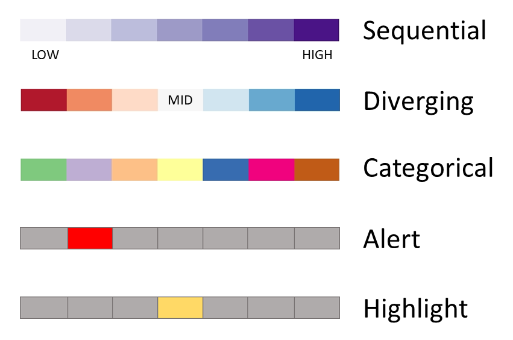
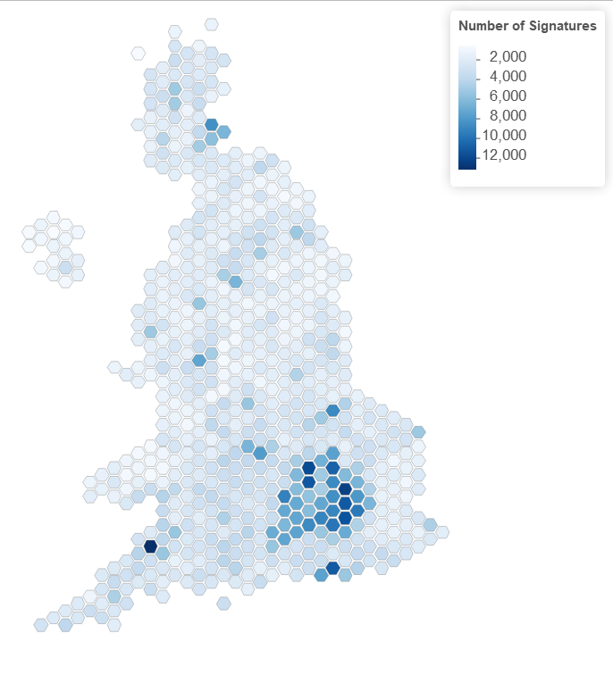
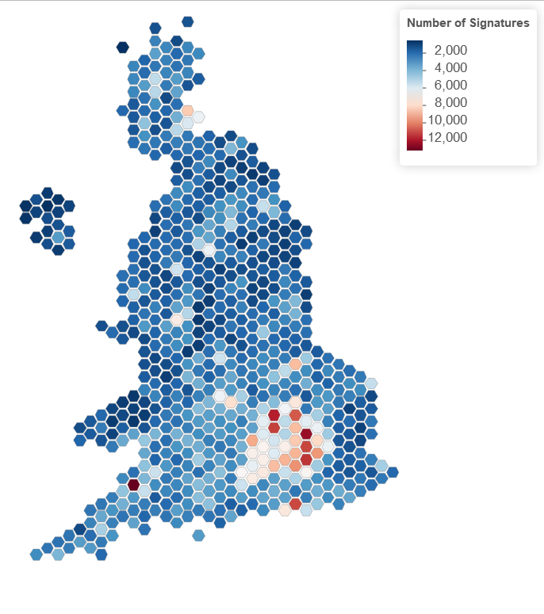
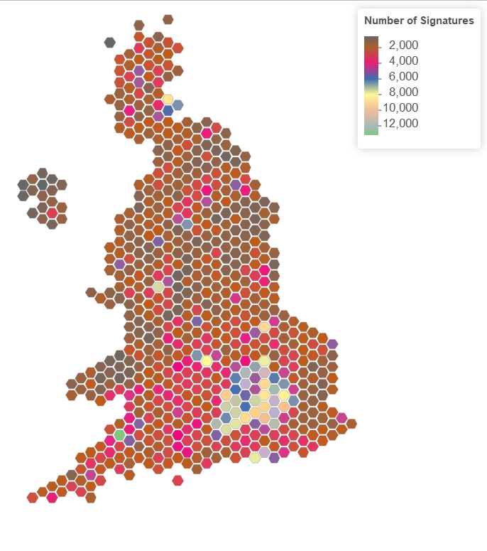

  
```{r setup, include=FALSE}
knitr::opts_chunk$set(echo = TRUE, fig.align = "center")
```

# Learning Objectives<br>

* Understand different colour schemes
* Be able to change the colour palette of a plot
* Be able to change the theme of a plot

**Duration - 1 hours 30 minutes**<br>
  

We're coming into the final stretch of `ggplot2` basics. We can now produce informative plots, but we also want our plots to be clear, and just to look good. 

Colour is one of the most important attributes in visualisation. It's also one of the most frequently misused. 


# Colour Schemes

We divide data visualisation colour schemes into five types.



**Sequential** colour schemes use a single colour from light to dark. They are most useful for representing a range of continuous quantitative values from low to high.

**Diverging** colour schemes use two colours to representing divergence from some mid point (both the direction and size of the divergence).

**Categorical** colour schemes use colour hue to distinguish between groups/categories.

Highlight/alert colours are used to draw the attention of the reader to a particular element of the visualisation. The distinction between the two is subtle, and is more connected to intent than any theoretical difference.

<blockquote class='task'>
**Task - 5 mins** 
Here is another map showing the number of signatories to a petition "Prevent Donald Trump from making a State Visit to the United Kingdom." We've done three colour schemes.

```{r, echo=FALSE, out.width = '80%'}

``` 
<br>
```{r, echo=FALSE, out.width = '80%'}

```
<br>
```{r, echo=FALSE, out.width = '80%'}

```	
<br> 
Discuss which type of colour scheme each of these is, and which is the most suitable.

<details>
<summary>**Answer**</summary>

* The first is a sequential colour map, and is by far the best.
* The second is a divergent colour map, which doesn't look terrible, but it's not clear what the significance of the midpoint is or why it makes sense to show regions with fairly high numbers of signatures in white, and regions with few or no signatures in bright red.
* The third isn't clear and it is an effort to read the data. This isn't a good thing.  

</details>
</blockquote>


# Colours in R

## Pre-defined colours in R

R also has a wide variety of predefined colour names available where we can just use the name of the colour. You can see  the list online [here](http://sape.inf.usi.ch/quick-reference/ggplot2/colour).  

For example, you can pick a colour off the chart and use it like so:

```{r}
library(tidyverse)
pets <- read_csv("data/pets.csv")

ggplot(pets) + 
  aes(weight, age) +
  geom_point(colour = "steelblue") 
```


## RGB encoding 

If you want to get more specific you can use RGB (red-green-blue) encoding, a base-16 number system to define colours. There are lots of RGB picker tools such as [this](https://www.w3schools.com/colors/colors_picker.asp). You get a RGB code, e.g. "#ff0000", which can use in place of one of the pre-defined colour names in R. 


```{r}
ggplot(pets) + 
  aes(weight, age) +
  geom_point(colour = "#3333cc") 
```


# Colour Palettes

Colour Palattes are also something that exist in R. These give you a range of colours to work from, without having to specify all the colours manually. Sometimes this is done by default, and sometimes it is not. For example, as we discussed in the first lesson, scales give the details of the mapping from the data to the aesthetic qualities, e.g. if the aesthetic mapping is `aes(colour = sex)` then it's the scale that defines which colours are assigned to which sex:

Sex			| Colour
--------|----------
Male    |   Blue
Female  |   Pink


For example: 

```{r}
ggplot(pets) + 
  aes(x = animal, fill = sex) + 
  geom_bar()
```


or if the aesthetic mapping is `aes(colour = age)` then it is likely a spectrum of colours corresponding to age:

Age | Colour
----|-------------
1		|	 Light blue 
12		|	 Dark blue 
1-12    |   Intermediate shade of blue in proportion to proximity of age to 1 and to 12.


For example, here we're plotting age vs weight, and colouring the points by sleep hours (which is a scale).   

```{r}
ggplot(pets) + 
  aes(x = age, y = weight, colour = sleep) + 
  geom_point()
```

Again, ggplot2 will detect the data type (discrete or continuous), create default scales for you, but sometimes you want to define your own colour scale.


# Continuous colours - sequential & diverging

## Sequential scale (i.e. 2-colour gradient)

This is the most basic colour gradient. There are two functions that let us do this: one applies to colour aesthetics, one applies to fill aesthetics. **As a reminder, fill defines the colour with which a geom is filled, whereas colour defines the colour with which a geom is outlined. But unless you're using those special shapes, if you use a point, give it a colour , not a fill (because most points don't have one).**

The two functions we use to make a 2 colour gradient are:  
  
* `scale_colour_gradient`
* `scale_fill_gradient`

Let's use `scale_colour_gradient` to set the colour of the points depending on the value of the `sleep` variable for each animal. We did this above already. The default colour scale is always blue.   

```{r, message=FALSE, warning = FALSE}
library(tidyverse)
pets <- read_csv("data/pets.csv")

ggplot(pets, aes(weight, age, colour = sleep)) +
  geom_point() +
  scale_colour_gradient()
```
<br>

If we want to change the scale, we need to give the high and low colour for the gradient in each function. As noted, we can use RGB codes, or we can just use named predefined colours, e.g.

```{r}
ggplot(pets, aes(weight, age, colour = sleep)) +
  geom_point() +
  scale_colour_gradient(low = "gray0", high = "gray100")
```

This gives us a grey scale plot.


<blockquote class='task'>
**Task - 5 mins** 

Can you change the colour scale to something else (either using an RBG colour or pre-defined)? 

<details>
<summary>**Example Answer**</summary>
```{r}
ggplot(pets, aes(weight, age, colour = sleep)) +
  geom_point() +
  scale_colour_gradient(low = "light blue", high = "dark blue")
```
</details>
</blockquote> 
<br> 


## Diverging scale (i.e. 3-colour gradient)

For a diverging scale essentially we construct 2 two-colour gradients, and define a midpoint value where the two gradients meet. The functions used are:

* `scale_colour_gradient2`
* `scale_fill_gradient2`

We've seen this applied above, but we repeat it here.

```{r}
ggplot(pets, aes(weight, age, colour = sleep)) +
  geom_point() +
  scale_colour_gradient2(midpoint = 15, low = "blue", high = "red", mid = "white")
```

<blockquote class='task'>
**Task - 5 mins** 

Look at the plot above. What does it tell you? **Write your interpretation of it down**. Do you think this colour scale is the best for it? If no, what would you change the colour scale to? 

<details>
<summary>**Example Answer**</summary>

* Some evidence of the older the more sleep (apart from Iolanthe the Cat, who seems to sleep a lot!), but would need more data to confirm this. 
* Both divergent and sequential could work here - divergent can be appropriate if the set mid point of 15 is of particular significance, if not sequential may be better. 
* Divergent colour scale would be more appropriate for something like temperature where the mid point may be 0 degrees and diverging red can be used for increasingly positive temperatures and vice versa for the colour blue for negative temperatures. 
</details>
</blockquote> 

<details>
<summary>**Extra - continuous colours task**</summary>

<blockquote class='task'>
**Task - 5 mins** 

Let's load the dataset `temp_df` which holds information on maximum temperature in Scotland for each month of year from 1910 to 2015. We are going to plot this as a heatmap using `geom_raster()`. 

```{r, message = FALSE}
temp_df <- read_csv("data/temp_df.csv")
head(temp_df)
```

```{r}
ggplot(temp_df) +
  geom_raster(aes(x = month, y = year, fill = max_temp))
```

Change the colour scheme to

1. A different two colour gradient (sequential)
2. A three colour gradient (diverging) - thinking about how might set the mid point. 

Which colouring do you think is best?

<details>
<summary>**Example answer**</summary>

```{r}
plot <- ggplot(temp_df) +
  geom_raster(aes(x = month, y = year, fill = max_temp))
```

1.
```{r}
plot +
  scale_fill_gradient(high = "red", low = "blue")
```

2.
```{r}
plot +
  scale_fill_gradient2(high = "red", mid = "white", low = "blue", midpoint = mean(temp_df$max_temp))
```

</details>
</blockquote>
</details>

# Discrete colours

The functions we looked at above work with **continuous** data points but now we are going to take a look at colour encoding if our data is discrete. 

We're going to look at the `students` dataset from this morning. We need to do a small bit of wrangling to get the year levels to appear in the correct order. 

```{r, message = FALSE}
students <- read_csv("data/students.csv")

students <- students %>%
  mutate(school_year = factor(school_year, levels = c("Year 7", "Year 8", "Year 9", "Year 10", "Year 11", "Year 12")))
```


## The default scale

The default scale picks evenly spaced colours on the colour scale. 

```{r}
ggplot(students) +
  aes(x = school_year, fill = superpower) +
  geom_bar() 
```


## Manual palettes

Manual palettes allow you to pick the colours that will be used in the graph. For manual palettes we can use the functions:

* `scale_colour_manual()`
* `scale_fill_manual()`

Let's use this to pick some nice colours for our superpower graph.  

```{r}
ggplot(students) +
  aes(x = school_year, fill = superpower) +
  geom_bar() +
  scale_fill_manual(
    values = c(
      "Fly" = "coral",
      "Freeze time" = "seagreen",
      "Invisibility" = "orange",
      "Telepathy" = "red"
    )
  )
```

**But** be wary of setting your own colours as for discrete colour scale want to make sure the colours are equally different from one another so we aren't implying any sort of ordering within the scale. Luckily there's been lots of research into colours and there's lots of pre-made colour schemes which have been tried and tested - one of them being Color Brewer. 


# Color Brewer palettes

[Color Brewer](http://colorbrewer2.org/) is a popular set of colour schemes and has palettes for sequential, diverging and categorical (they call qualitative) data.  Each scheme has a name, and `ggplot2` includes functions that can automatically select these palettes by name. This is great as means we don't need to write out the RGB for each element in the scheme to use it. 

It also allows you to chose colour schemes which are colour-blind friendly (which we discuss shortly) and print and photocopy safe (so colour distinctions can be seen even after the visual is printed/photocopied). 

For continuous data (both sequential and diverging) we can use: 

* `scale_colour_distiller`
* `scale_fill_distiller`

Let's plot our `pets` data again, this time using `scale_fill_distiller` instead picking a sequential palette.  

```{r}
ggplot(pets, aes(weight, age, colour = sleep)) +
  geom_point() +
  scale_colour_distiller(palette = "RdPu")
```

As you can see, it chooses the colours based on whatever palette you've chosen.   

For discrete data (which on Color Brewer is called 'qualitative') we can use: 

* `scale_colour_brewer()`
* `scale_fill_brewer()`

Again the names can be found on the Colour Brewer website. 

```{r}
ggplot(students) +
  aes(x = school_year, fill = superpower) +
  geom_bar() +
  scale_fill_brewer(palette = "Set1")
```


# Colour-blindness

Colour blindness (or, more accurately, colour vision deficiency) is an inherited condition. Contrary to popular belief, it is rare for a colour blind person to see only in shades of grey - rather their ability to distinguish between certain hues is heavily impaired. The inability of your audience to distinguish hues is still a serious problem though if you've colour coded your lines so they know which group is which, or if you've made one of your bars bright red to draw their attention to it.

If 4-5% of the population (UK prevalence of colour blindess) are unable to read your visualisation, this is not a trivial consideration; especially if your graphic is to be distributed more widely.

In short, we need to consider the impact of colour blindness if we use colour in our graphics.

There are three types of colour blindness.

* Protanopia (red weak)
* Deuteranopia (green weak)
* Tritanopia (blue weak)

The last of these is very rare ($<0.5\%$ of the population). The primary problem with colour blindness is with red and green. For this reason it is strongly advised not to use red and green together. However, the inability to see these colours will affect the way you perceive other colours, e.g. you will struggle to distinguish between blue and purple. 


Luckily, R has some easy to use colour palettes that work for colour blindness (which are covered in the drop down below), and as we have seen Color Brewer has colour-blind friendly options too. 

```{r}
ggplot(students) +
  aes(x = school_year, fill = superpower) +
  geom_bar() +
  scale_fill_brewer(palette = "Dark2")

```

<br> 

<details>
<summary>**Extra - Colour-blind friendly palettes in R**</summary>

For discrete data we can use:

* `scale_colour_colorblindr()`
* `scale_fill_colorblind()`

from the `ggthemes` package. Note, that the function uses the American spelling of colour. 

```{r}
library(ggthemes)

ggplot(students) +
  aes(x = school_year, fill = superpower) +
  geom_bar() +
  scale_fill_colorblind()
```


For continuous variables you can use:

* `scale_colour_viridis()`
* `scale_fill_viridis()`

 from the package `viridis`. There is 5 different colour schemes available that can be seen [here](https://cran.r-project.org/web/packages/viridis/vignettes/intro-to-viridis.html)

```{r, message = FALSE}
library(viridis)

ggplot(temp_df) +
  geom_raster(aes(x = month, y = year, fill = max_temp)) +
  scale_fill_viridis(option = "magma")  
```

</details>
<br>


<blockquote class='task'>
**Task - 5 mins** 

Change the colour scheme of the `students` plot to a colour-blind friendly Color Brewer palette. 
<details>
<summary>**Hint**</summary>
Remember to think about it's a continuous or discrete palette that is appropriate for this data. 
</details>

<details>
<summary>**Example Answer**</summary>


```{r}
ggplot(students) +
  aes(x = school_year, fill = superpower) +
  geom_bar() +
  scale_fill_brewer(palette = "Paired")
```

 
</details>
</blockquote> 
<br> 

# Custom colour palattes

There are lots of colour palettes to be found online and/or in additional packages that people have made - such as `ggthemes` [here](https://www.rdocumentation.org/packages/ggthemes/versions/3.5.0) which replicates colours used by organisations and products such as Wall Street Journal, Tableau, Excel and The Economist. For example below is a palette used by Wall Street Journal in their publications: 

```{r}
ggplot(students) +
  aes(x = school_year, fill = superpower) +
  geom_bar() +
  scale_fill_wsj()
```

Here is one based on the popular Wes Anderson movies. [Github page wesanderson](https://github.com/karthik/wesanderson). 

```{r, eval = FALSE}
install.packages("wesanderson")
```

```{r}
library(wesanderson)

ggplot(students) +
  aes(x = school_year, fill = superpower) +
  geom_bar() +
 scale_fill_manual(values = wes_palette("FantasticFox1"))
```

[Or for example, one with the BBC colour palatte](https://github.com/bbc/bbplot)

```{r, eval = FALSE}
devtools::install_github('bbc/bbplot')
```

```{r}
library(bbplot)

ggplot(students) +
  aes(x = school_year, fill = superpower) +
  geom_bar() +
bbc_style()
```


There are many more out there to choose from. It is also possible to create your own colour palette - for example if you work for organisation who have their own colour/branding you may wish to make your own palette to use. However if you do this you will want to take on board what we covered today when doing so to ensure that 'looks' aren't overriding whether the plot is effective and translates the data well.   

One easy way to do this is to extract colours from images using the `colorfindr` package. [You can find a tutorial on how to do this here](https://github.com/annahensch/R-tutorials/blob/master/ggplot-on-fire.md)  


# Themes

Themes are the final thing we will cover. Themes are concerned with the purely stylistic. e.g. font size, title placement, legend placement, grid lines, axis lines, background colour, etc. This doesn't mean they're unimportant though, in fact clarity and visual attractiveness are vital.

We'll look at the standard themes available quickly, or you can create your own themes (or adjust the standard themes).

## Standard themes

There are 8 standard themes and we can see them visually [here](https://ggplot2.tidyverse.org/reference/ggtheme.html):

* `theme_grey()` 
* `theme_bw()`          
* `theme_linedraw()`    
* `theme_light()`      
* `theme_dark()`    
* `theme_minimal()`  
* `theme_classic()` 
* `theme_void()`        

Let's try a few of these now.  

```{r}
ggplot(students) +
  aes(x = school_year, fill = superpower) +
  geom_bar() + 
  theme_minimal()
```

```{r}
ggplot(students) +
  aes(x = school_year, fill = superpower) +
  geom_bar() + 
  theme_bw()
```


All of these themes have a `base_size` parameter which controls font size. The themes automatically adjust font sizes for different annotations (e.g. title x1.2, tick labels x0.8). If you want more precise control of the font sizes you'll need to adjust the individual elements as discussed in the next section.


<blockquote class='task'>
**Task - 2 mins** 

Looking at the themes [here](https://ggplot2.tidyverse.org/reference/ggtheme.html) which do you think meet the principles of minimising non-data ink (see first lesson) but also making it easy to read? 

<details>
<summary>**Example Answers**</summary>

* `theme_classic()` is good in terms if removing any background colours (which are non-data ink)
* `theme_bw()` and `theme_light()` are also good - the gridlines they are quite faint (so don't detract much from the data points) and can aid in reading values of each point. 


</details> 
</blockquote>  


## Theme Elements

Themes are made up of *theme elements*. There are vast number of theme elements found [here](https://ggplot2.tidyverse.org/reference/theme.html) such as titles, axis ticks, legend, background etc. Most of these elements can be set using four functions:

* `element_text` formats text, such as titles and axes labels.
* `element_line` customising grid lines or axis lines (can change line colour, size and linetype (e.g. dashed etc.). 
* `element_rect` draws rectangles, mostly used for background fill and border colour.
* `element_blank` used to override the default when you don’t want an element in your graph (e.g. removing an axis title). 

We are able to customise each of these elements of any of the standard themes if we want. You can find more details in the ggplot theme elements [page](https://ggplot2.tidyverse.org/reference/element.html). 

Let's take a look at customising the text element. 

### Text

`element_text` formats text, such as titles and axes labels. Basic adjustments to size, face and colour. Font face options include `c("plain","bold","italic","bold.italic")`. 

Let's say we see our axis ticks are quite small and difficult to read. We can increase the size in 2 ways. We can set a size number, with the default being 11 for the `theme_gray()` theme we are using. 

```{r}
ggplot(students) +
  aes(x = school_year, fill = superpower) +
  geom_bar()  +
  theme(axis.text = element_text(size = 16))
```

We can also use `rel()` function to change the size relative to default size. Here we make it 1.5x times the size of the default (which is about `size = 16.5`). 

```{r}
ggplot(students) +
  aes(x = school_year, fill = superpower) +
  geom_bar()  +
  theme(axis.text = element_text(size = rel(1.5)))
```


And we can make the font bold by doing the following:  

```{r}
ggplot(students) +
  aes(x = school_year, fill = superpower) +
  geom_bar()  +
  theme(axis.text = element_text(face = "bold"))
```


Sometimes will find labels overlap depending on how long and how many there are. For example if we plot a histogram of the favourite subject it's hard for us to read all the labels: 

```{r}
ggplot(students) +
  aes(x = favorite_school_subject) +
  geom_bar()  
```

Here, we can use the theme to rotate the labels using the `angle` argument - you can specify what angle to rotate at and also use `hjust` and `vjust` arguments to
justify vertically and horizontally (on a range between [0,1]). 

```{r}
ggplot(students) +
  aes(x = favorite_school_subject) +
  geom_bar() + 
  theme(axis.text.x = element_text(angle = 45, hjust = 1))
```

Another option, instead of using the theme to edit it, is to flip the graph so that it sits horizontally using `coord_flip()`. 

```{r}
ggplot(students) +
  aes(x = favorite_school_subject) +
  geom_bar() +
  coord_flip()
```


## Custom Themes

Like the colour palettes there is loads of themes people have made online that you can use or there are additional packages you can load with more themes (`ggthemes` [here](https://www.rdocumentation.org/packages/ggthemes/versions/3.5.0), which like with the colour palettes, also more generally replicates the themes used by organisations and products) - we encourage you to have a browse in your own time to find some you may like. 


You may wish to create your own theme, which you can 'save' and reuse over and over without writing out all the customised elements every time you make a plot. This [webpage](https://emanuelaf.github.io/own-ggplot-theme.html) gives a good example of doing this. Like the colour palettes this may be useful if you work for organisation who have their own colour/branding and you want to keep the style of plots consistent throughout reports and presentations produced across your organisation. 


# Optional - theme exercise 

<blockquote class='task'>
**Task - 15 mins** 

Let's load in the following dataset `scottish_exports` which has data on levels of exports for different sectors in Scotland over time. 

```{r, message = FALSE}
scottish_exports <- read_csv("data/scottish_exports.csv")
```

Here is a basic plot. The client prefers dark backgrounds, but otherwise you're free to display it as you like. 

Make it look as good as you can.

```{r, eval = TRUE, ech0 = TRUE}
ggplot(scottish_exports) +
  geom_line(aes(x = year, y = exports, colour = sector)) +
  facet_wrap(~sector, scales = 'free_y')
```

<details>
<summary>**Answer**</summary>

```{r, message=FALSE}
# An example of an answer
scottish_exports <- scottish_exports %>%
  mutate(sector = case_when(
    sector == "Mining_Quarrying" ~ "Mining/Quarrying",
    sector == "Agriculture_Forestry_Fishing" ~ "Agriculture/Forestry/Fishing",
    TRUE ~ sector
  ))
```

```{r}
ggplot(scottish_exports) +
  geom_line(aes(x = year, y = exports, colour = sector), size = 1) +
  facet_wrap(
    ~sector,
    scales = 'free_y'
  ) +
  labs(
    title = "Scottish Exports through Time",
    x = "\nyear",
    y = "Export Volume\n"
  ) +
  scale_colour_brewer(guide = "none", palette = "Set2") +
  theme_minimal(12) +
  theme(
    panel.background = element_rect(fill = "#0f1966"),
    panel.grid = element_blank(),
    plot.title = element_text(size = 18)
  )
  
```


</details>
</blockquote>


