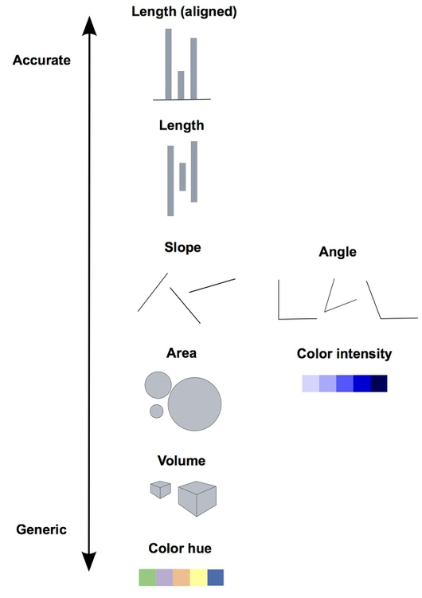

  
  
```{r setup, include=FALSE}
knitr::opts_chunk$set(echo = TRUE, fig.align = 'center')
```

# Learning Objectives<br>


* Be exposed to how the brain takes in information visually
* Understand the different pre-attentive attributes for data
* Know what makes a good visualisation

**Duration - 1 hours**<br>
  
To start, we're going to look at some examples of how we take in information visually, and discuss the role of "preattentive attributes" in this process. We'll then look at some more practical examples and see how these attributes function in practice. We'll wrap up with some tips on what makes a good visualisation.

# Visual Encodings

As you've seen so far, you have lots of options for how you map your data onto elements of the plot: length, size, colour etc. In `ggplot2` they are called aesthetics but they are also known as "visual encodings".

<blockquote class='task'>
**Task - 2 mins** 

Try to estimate the associated costs with the other offices based on the areas shown.

```{r, echo=FALSE, fig.cap="Figure 11 Cost Areas", out.width = '100%'}

```	

<details>
<summary>**Answer**</summary>
```{r, echo=FALSE, fig.cap="Figure 12 Cost Areas", out.width = '100%'}
knitr::include_graphics("images/cost_areas2.jpeg")
```	
</details>

</blockquote>

Not so easy is it?

If you want to use a visual encoding to represent continous data, some encodings are better than others.  In the mid-1980s, statisticians William Cleveland and Robert McGill measured how accurately volunteers were able to perceive the quantitative information encoded by different cues. The visual below summarises their findings.



The volunteers found it much easier to correctly read graphs that use length, compared to graphs that use colour hue to encode continuous variables.

# Order 

Let's load in the data `total_sales`, which has data on the sales for different branches of a store. A simple bar chart gives a visual representation of this data: 

```{r, message = FALSE}
library(tidyverse)

total_sales <- read_csv("data/total_sales.csv")

ggplot(total_sales) +
  aes(x = branch, y = sales) +
  geom_col() +
  coord_flip()
```

We're using a visual variable here - length. Length is one of the best attributes for communicating quantitative data like this because they make comparisons very easy.

But the position of these bars is also important and it can make more sense to order them (by size in this case). 

To do this we can use the function `reorder` which takes first categorical variable, and reorders its levels based on the values of a second variable, usually numeric. In our example that will be first `branch`, order by the value of `sales`.

```{r, message = FALSE, warning = FALSE}
ggplot(total_sales) +
  aes(x = reorder(branch, sales), y = sales) +
  geom_col() +
  coord_flip()
```

If we wanted it to be descending we just put a `-` in front of the ordering variable. 

```{r, message = FALSE, warning = FALSE}
ggplot(total_sales) +
  aes(x = reorder(branch, -sales), y = sales) +
  geom_col() +
  coord_flip()
```

# Optional - Highlighting (Preattentive attributes)

Of course, encoding continuous variables isn't the only thing we want to do in graphs. Here is a simple matrix of numbers. We are, for whatever reason, interested in how many 1's there are in this grid.

```{r, message = FALSE, echo=FALSE}
library(tidyverse)
table_of_numbers <- read_csv("data/table_of_numbers.csv")

ggplot(table_of_numbers) +
  aes(x = x, y = y, label = num) +
  geom_text() +
  theme_void()
```

<blockquote class='task'>
**Task - 2 mins** 
Count the 1's. 

<details>
<summary>**Answer**</summary>

There are 9.

</details>

</blockquote>

That felt like too much effort. Let's make it easier.

```{r, echo = FALSE, warning = FALSE}
ggplot(table_of_numbers) +
  aes(x = x, y = y, label = num, colour = num == 1) +
  geom_text() +
  scale_colour_manual(values = c('black', 'red'), guide = FALSE) +
  theme_void()
```

It becomes vastly easier now due to the colour differences. We're very good at spotting this sort of difference. 

Colour is a preattentive attribute. **Preattentive attributes** are visual properties that are processed in sensory memory; no conscious effort is needed from the user (or viewer) to do this processing - it's automated and takes less than 500 milliseconds to complete. 

As you can imagine, these have great value in data visualisation. Used properly they can grab the viewer's attention without any effort on the viewer's part.

This can be very useful in design and in particular in information visualization design because it allows the designer to grab the attention of the user without their input or effort. 

What other attributes can we use?

Size:

```{r, echo = FALSE, warning = FALSE}
ggplot(table_of_numbers) +
  aes(x = x, y = y, label = num, size = num == 1) +
  geom_text() +
  guides(size = "none") +
  theme_void()
```

<br>

Colour intensity:

```{r, echo = FALSE, warning = FALSE}
ggplot(table_of_numbers) +
  aes(x = x, y = y, label = num, alpha = num == 1) +
  geom_text() +
  guides(alpha = "none") +
  theme_void()
```

<br>

Enclosure:

```{r, echo = FALSE, warning = FALSE}
ggplot(table_of_numbers) +
  aes(x = x, y = y, label = num) +
  geom_text() +
  geom_tile(
    colour = "black",
    fill = NA,
    data = subset(table_of_numbers, num == 1)
  ) +
  theme_void()
```


If you want to do effective highlighting with preattentive attributes your best options are:

* Colour hue, e.g. black vs red
* Colour intensity, e.g. light grey vs dark grey
* Size, e.g. big vs small
* Orientation, e.g. horizontal text vs text displayed at 45 degrees
* Added Marks, e.g. underline the 1's
* Enclosure, e.g. boxes around the 1's

## Highlighting - graph example


So we know how to reorder our bar chart so it's easier for our audience to quickly see how branches compare in terms of sales. But let's say we want to highlight the performance of a particular branch, we might utilise a little colour as well.

```{r}
ggplot(total_sales) +
  aes(x = branch, y = sales, fill = branch == "Leeds") +
  geom_col() +
  scale_fill_manual(values = c('grey40', 'red'), guide = "none") +
  coord_flip()
```

You could even go one step further and add some annotation using `geom_text()`:

```{r}
# a data frame with all the annotation info
total_sales_anno <- total_sales %>%
   mutate(label_text = ifelse(branch == "Leeds", "The Leeds branch has 715k sales", NA))

ggplot(total_sales_anno) +
  aes(x = branch, y = sales, fill = branch == "Leeds") +
  geom_col() +
  scale_fill_manual(values = c('grey40', 'red'), guide = "none") +
  coord_flip() +
    geom_text(aes(label = label_text),                  
           color = "red", size = 4, hjust = 0) 
  
```

This isn't sophisticated, but it can be remarkably effective.

<br>

# Purpose 

Throughout planning and creation of visualisation we want to be considering the purpose and audience of our visual. Who are the audience? What are their objectives? What are they looking to understand from this visual? How can we incorporate this into the design? 

Below are in an exercise in thinking about these things. We take the data used for a graph and use the data to create a new graph to more closely align the objective of the analysis. Same data, different graph. 

<blockquote class='task'>
**Task - 5 mins** 

Suppose we're doing a comparison between January and April now. We want to understand which branches are improving. For this we can look in the dataset `monthly_sales`.  The variable `difference_from_january` has each month's sales differences from January.  

```{r, message = FALSE}
monthly_sales <- read_csv("data/monthly_sales.csv") %>%
  mutate(month = factor(month, levels = c("Jan", "Feb", "March", "April"))) 

head(monthly_sales)
```

```{r}
ggplot(monthly_sales) +
  aes(x = branch, y = sales, fill = month) +
  geom_col(position = "dodge") +
  coord_flip()
```

This graph is pretty cluttered and it's not clear what we are trying to show. 

Rewrite the graph above in a more compelling manner. Consider how you could emphasise which branches have been most successful in the month of April compared to January. 

<details>
<summary>**Answer**</summary>

Something like this.

```{r, message=FALSE, warning=FALSE}
monthly_sales_april <- monthly_sales %>%
  filter(month == "April") 
```

```{r}
min_max <-max(abs(monthly_sales_april$difference_from_jan))
  

ggplot(monthly_sales_april) +
  aes(
    x = reorder(branch, difference_from_jan),
    y = difference_from_jan,
    fill = difference_from_jan > 0
  ) +
  geom_col() +
  ylim(-min_max, min_max) +
    labs(y = "Difference in sales", x = "Branch location", title = "Sales differences between January and April") + 
  scale_fill_manual(values = c("tomato", "seagreen"), name = "", labels = c("decrease", "increase")) +
  theme_minimal() +
  theme(axis.text.x = element_text(angle = 45, hjust = 1))
```

</blockquote>


## Line Charts

Let's look at another graph type.

<blockquote class='task'>
**Task - 5 mins** 
Here is the same information as our first barchart, shown in a line chart.

```{r}
ggplot(monthly_sales) +
  aes(x = month, y = sales, group = branch, colour = branch) +
  geom_line() 
```

1. Which graph is superior for comparing sales growth between branches?
2. Which graph is superior for comparing sales in April between branches?
3. A colleague proposes using the grouped bar chart but changing the order of branches between months so they are ordered by sales numbers in that month. Comment on this suggestion.
4. A senior manager suspects the proportion of sales arising from Northern offices (Edinburgh, Glasgow, Leeds, Manchester) are growing relative to southern offices. Produce a visualisation that speaks to this.

<details>
<summary>**Answer**</summary>

1.  The line graph is superior - the grouped bar chart requires greater mental work to identify which bars belong to the same branch. They are colour coded, but we have too many colours and it's no longer popping out.

2. Both are fit for purpose here, but neither is notably better at this. More generally the line chart seems as good or better than the grouped bar plot for this data for the applications that occur to me.

3. In contrast to the previous example, this sounds like a bad idea. It's hard enough to compare a branch's performance between months - mixing up the order of the bars sounds like a recipe for confusion.

4. 

```{r, message = FALSE}
library(scales) 

monthly_sales_region <- monthly_sales %>%
  mutate(northern = branch %in% c("Edinburgh", "Glasgow", "Leeds", "Manchester"))

ggplot(monthly_sales_region) +
  aes(x = month, y = sales, group = branch, colour = northern) +
  geom_line() +
  scale_y_continuous(labels = comma) #avoid scientific notation of y values
```

</blockquote>


Line charts are a particularly good way of representing multiple time series. The lines segments between the observations (often coupled to colour) are a great way of connecting observations from the same series.


# Closing Thoughts

Creating successful visualisations requires you to use these attributes. There are no widely agreed rules on these, and learning what makes a successful visualisation is often just a matter of experimentation with different ideas and seeing what works. 

That and looking at other people's ideas!

But, here are some principles you can take or leave:

1. Colour - limit to five at most, and use for specific purposes, not decoration
2. Fonts - select a clear and appropriate font and stick with it (avoid graph annotations that look like ransom notes)
3. Layout - guide readers though a logical hierarchy, e.g. order your bars, structure your process diagram, etc.
4. Text annotations - use these very sparingly
5. Don't try to eliminate too much "white space" or your charts will start to look cluttered and incoherent
6. Only use images if they're appropriate to tone and subject matter, and only if they enhance the content in some way.
7. Icons should be simple, easy to understand, and used consistently
8. Don't overwhelm the reader with multiple graphs of single data points - aggregate and summarise where you can
9. Consistency - comparisons are aided by consistency, using lots of different shapes can make it difficult to compare lengths or sizes 
10. Simplicity - avoid chart-junk - everything in your graph should serve a purpose.

# Optional - Wrapping up exercise

<blockquote class='task'>
**Task - 10 mins** 

The dataset `got_ratings` contains the episode ratings for the TV series Game of Thrones. Produce a graph. 

The viewer should:

* be able to understand the chronology of the ratings
* be able to attribute each rating to a particular season
* be able to view some indicator of the perceived quality of each season overall
* notice the perceived decline of the series in the final season

You do not need to use the data on number of reviews. 

<details>
<summary>**Example answer**</summary>


```{r}
got_ratings <- read_csv("data/got_ratings.csv")

ggplot(got_ratings) +
  aes(x = episode, y = average_rating, col = as.factor(series)) +
  geom_point(show.legend = FALSE) +
  geom_smooth(method = "lm", show.legend = FALSE) +
  scale_x_continuous(breaks = seq(1, 10, 2)) +
  scale_y_continuous(breaks = seq(10)) +
  facet_grid(. ~ series) +
  theme_minimal(14)
```

</details>

</blockquote>


# Additional Resources

Links of where else to look

* [More examples of pre-attentive attributes](https://learnforeverlearn.com/preattentive/)
* [11 Best Practices for Infographic Design and Distribution](https://www.columnfivemedia.com/11-best-practices-for-infographic-design-and-distribution)
* [Guidelines for Good Visual Presentations](https://www.interaction-design.org/literature/article/guidelines-for-good-visual-information-representations)
* [Example of pre-attentive attributes](http://www.storytellingwithdata.com/blog/2011/10/google-example-preattentive-attributes)


