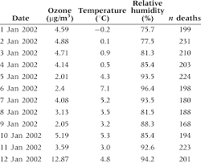
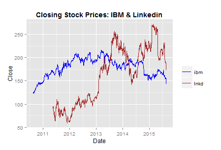
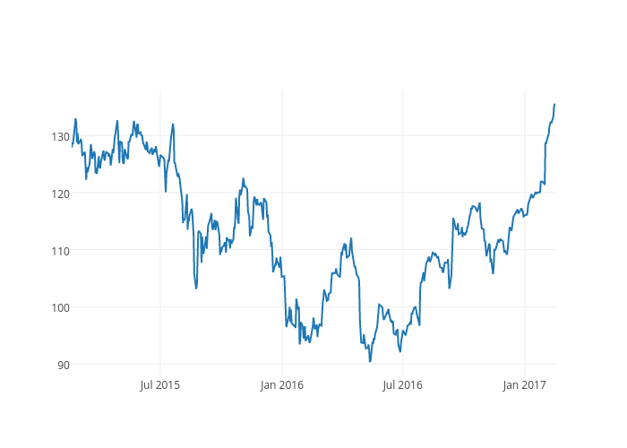
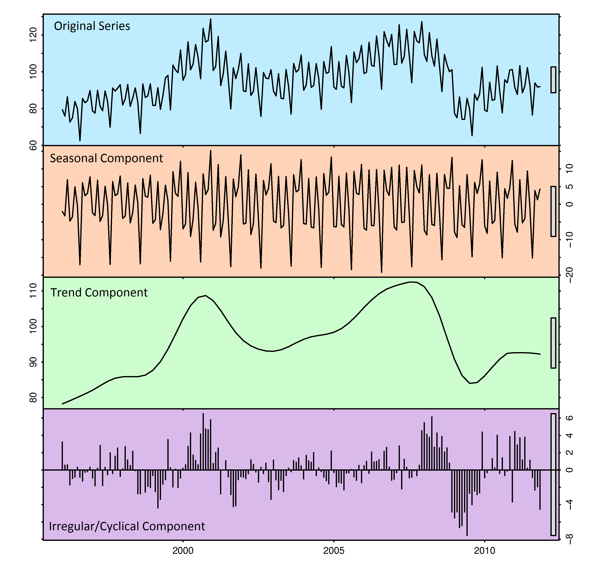
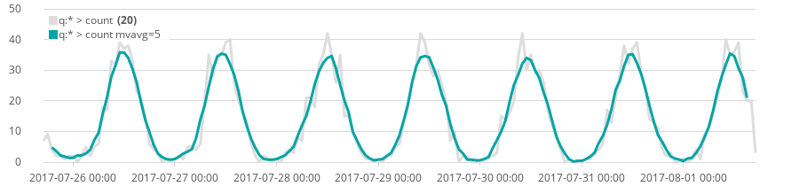
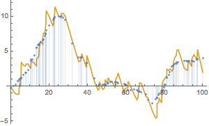
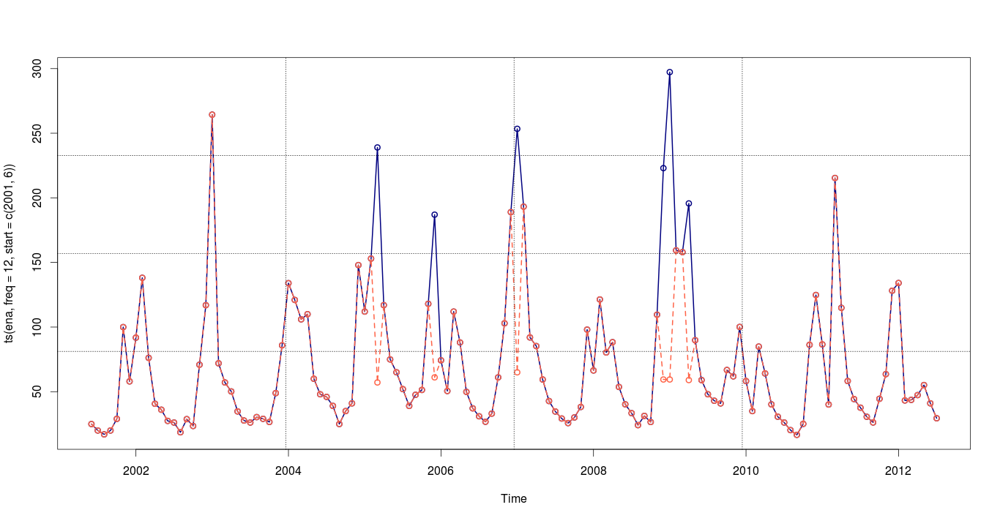
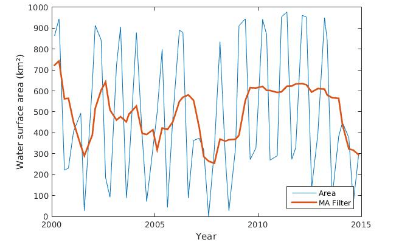

```{r setup, include=FALSE}
knitr::opts_chunk$set(echo = TRUE, fig.align = 'center')
library(tidyverse)
```

# Learning objectives

  1. Know what time series data look like
  2. Understand some of the key components of time series data
  3. See some examples of the application of time series data
  4. Understand why familiarity with time series data is important

**Duration: 30 mins**

*** 

# What is time series data?
<br>

The simplest explanation of time series data is : **time series datasets track and represent changes in a system over time.**
<br>

Time series data is a sequence of data points taken at successive (often equally spaced) points in time. In other words, time-series data are generally 'append-only'.  

This practice of recording each and every change in a system or process as a new, different row is what makes time series data so powerful. Time isn't just a metric in itself, but rather a primary axis. It allows us to measure change: analyze how something changed in the past, monitor how something is changing in the present, predict how it may change in the future.


***

# What does time series data look like?

<br>
Time series datasets have three broad things in common: 

1. Arriving data is almost always recorded as a new entry  
2. The data typically arrives in time order  
3. Time is a primary axis (time intervals can be either regular or irregular)  
<br>
  
Let's take a look at some examples of time series data. 

<br> 

```{r, echo=FALSE, fig.cap="", out.width = '50%'}

```
<br>

```{r, echo=FALSE, fig.cap="", out.width = '90%'}

```

<br>

```{r, echo=FALSE, fig.cap="", out.width = '90%'}

```
 
<br>

```{r, echo=FALSE, fig.cap="", out.width = '90%'}
knitr::include_graphics("images/time_series_4.png")
```
  

This practice of recording each and every change to a system or process as a new row is what makes time-series data so powerful. It allows us to measure change: analyse how something changed in the past, monitor how something is changing in the present, predict how it may change in the future.

# Key components of time series data 
<br>

Time series data can be broken down into different components.   

1. **Trend** - this is the increase or decrease in the series over a period of time, which persists over a long period of time. For example, time series data relating to population growth or number of houses in a city often show upward trend, whereas data relating to mortality rates and epidemics often show downward trends. 

2. **Seasonality** - a regular pattern of increasing and decreasing fluctuations, aka short-term variation often occurring due to seasonal factors. For example sales of ice-cream probably increase in summer and decrease in the winter, whereas sales of warm, waterproof clothing likely increase in winter and decrease in the summer. *Seasonality is always of a fixed and known period*.

3. **Cyclicity** - Cyclical variation in a time series describes the medium-term changes in the series, caused by circumstances, which repeat in cycles. The duration of a cycle often extends over a longer period of time than seasonal fluctuation, typically to two or more years. Most economic and financial time series show some kind of cyclical variation. For example, a typical business lifecycle might consist of four phases:  (i) prosperity, (ii) decline, (iii) depression, and (iv) recovery. *Cyclical variation often has no fixed period, and it is difficult to say at the start of a cycle how long it will last*.

4. **Irregularity:** Irregular or random variations in a time series are caused by unpredictable influences, that do not repeat with any identifiable pattern. These variations could be caused by incidences such as war, strike, earthquake, flood, revolution, etc. There is no defined statistical technique for measuring random fluctuations in a time series.

Examples of these components are shown below: 

```{r, echo=FALSE, fig.cap="", out.width = '80%'}

```

# Time series structure 

Time series data corresponds to data points collected over time. Crucially, the ordering of the time points matters.  

For example, if you collected the height of children in a class, it doesn’t matter the order in which the data are obtained or reported. However, if you were trying to collect data about how global temperature changes over time, the ordering is crucial: for clarity and inference it is important that the data is collected and presented in sequential order.  

So time series data is always structured **in sequential time order**. However, The overall pattern of your time series data in different ways:    

* **Regular** - data which has been collected at regularly spaced intervals of time - for example: every hour, every day, every month, etc.  

```{r, echo=FALSE, fig.cap="", out.width = '100%'}

```

* **Irregular** - data still appears in temporal order, but the measurements might not happen at a regular time interval.

```{r, echo=FALSE, fig.cap="", out.width = '80%'}

```

Additionally, your time series data can be seasonal or non-seasonal:

* **Seasonal** - patterns, or seasonality, are cycles that repeat regularly over time. A repeating pattern within each year is known as seasonal variation, although the term is applied more generally to repeating patterns within any fixed period. 

```{r, echo=FALSE, fig.cap="", out.width = '100%'}

```

* **Non-seasonal** - data lacking a seasonal component. Non-seasonal time series consists of a trend component and an irregular component.

```{r, echo=FALSE, fig.cap="", out.width = '100%'}

```

Now we know what time series is, we can start working with it in R.

# Where do we encounter time series data?

Time series data is everywhere. For example:

**Finance**: how stock markets, currency, exchange rates, etc. vary over time. Trading algorithms continuously collect data on the time variation of markets.  

<center>

</center>

<br>

**Environmental**: organisations and weather stations continually collect weather readings and other environmental data, and study their variation over time.

<center>

</center> 

<br>

**Health**: data is collected on patient wait times, number of patient visits, morbidity and mortality etc. in order to plan and allocate funding. In addition, companies are developing patient monitoring systems that continuously collect data on vital signs and can alert health workers if significant changes are noticed.  

<center>

</center>

<br>

**Digital and Technology**: Managed environment systems and smart home meters monitor room temperature, air quality and can adjust building systems accordingly. Self-driving cars continuously collect data on their local environment.   

<center>

</center>

<br>

**Gaming and Entertainment**: companies collect data on how many users install an app, how much time they they spend online, how long their sessions last

<center>

</center>

<br>

**Retail and Logistics**: the retail and logistics industries monitor assets and stock and their movements, footfall in stores and use of apps, and can forecast demand with such precision and efficiency that cheap same-day delivery is a luxury that many of us take for granted.    

<center>

</center>


# Why is time series analysis important?

Time series analysis can be used to understand the past as well as predict the future. Two main types of analyses are common: 

* Analyse past phenomena represented by a sequence of observations and identify important factors (time series analysis). This can be both descriptive and explanatory, and can involve cross-correlation of two or more time series.
* Predicting future values of the response variable based upon previous data (forecasting). This is particularly common in the financial, retail and logistics sectors. Short term forecasts into the near future tend to be more accurate than longer term forecasts.

<br>

<center>

</center>

# Recap

* What are the four main components of time series data?
<details>
<summary>**Answer**</summary>
Trend, seasonality, cyclicity and irregularity.
</details>

* What is the difference between seasonality and cyclicity?
<details>
<summary>**Answer**</summary>
Seasonality occurs over a short time span (the seasons), whereas cyclicity is over a longer period. 
</details>

* What are the main benefits of time series analysis?
<details>
<summary>**Answer**</summary>
It studies the past behaviour of the phenomenon.
It compares the current trends with that in the past or the expected trends.
It is used in forecasting sales, profit etc. and policy planning by various organisations.
The cyclic variation help us understand the business cycles.
The seasonal variation are very useful for businesses and retailers as they earn more in certain seasons.
</details>

<hr>

# Additional resources

[Intro to time series analysis](https://medium.com/greyatom/introduction-to-time-series-analysis-431beb02adc4)

[What is time series data](https://blog.timescale.com/blog/what-the-heck-is-time-series-data-and-why-do-i-need-a-time-series-database-dcf3b1b18563/)  

[What are the benefits of time series data](https://www.quora.com/What-is-time-series-analysis-What-are-its-advantages-and-disadvantages)  


