```{r setup, include=FALSE}
knitr::opts_chunk$set(echo = TRUE, fig.align = 'center')
```

# Learning Objectives

* Understand Git naming conventions
* Know how to create, move between and merge branches
* See how to resolve conflicts and tools to help
* See an example of Git branching and conflict when developing a Shiny app

**Lesson Duration - 90 mins**

# Introduction

So far we've been using Git primarily as a file-sharing system: instructors can upload notes and data to share with students while students can upload homework for instructors to check. On some occasions we've even been able to use Github as a data-recovery service and save some lost work. One of the most powerful aspects of Git is something we haven't come across yet: the possibility to work together simultaneously on a project and have Git pull all our changes together for us.

# Branches

We are able to do this because Git enables us to have multiple versions of our project existing at the same time, each of which sits on a **branch** of our repository. Until now we've been working in repositories with a single branch - `main` - which is created for us when we initialise the repo. Every commit we make is added to this branch which is fine when we're working on our own, but as soon as a second person starts contributing to our project it has the potential to throw up some problems. What happens if someone pushes something when we don't expect it? What if they change the file structure? What if we're both working on the same file?

Branches won't solve all of these problems (communication between team members is the only way to achieve that), but they'll help us to minimise their impact.

## The `main` Branch

In addition to being the default branch, `main` typically represents the current "live" version of your project. If a client wanted to download a copy of your project, the main branch should be what they get. With that in mind we want to ensure that it only ever contains stable, working code.

## The `develop` Branch

A common practice is to have a `develop` branch available at all times. This branch will contain the code for the next version of your project, updated every time a bug is fixed or a new feature is added. It shouldn't be publicly available in the same way `main` is, but should still only contain working code. Not every project uses this structure, especially when updates are small or infrequent, but it is often useful.

## Feature Branches

Feature branches are for what their name suggests: adding new features. Those features usually each have their own branch, which are normally called something like `feature/feature_name` and are deleted when work on the feature is complete. These represent work in progress, and while it's not ideal to commit broken or buggy code it's not unusual to do it on a feature branch.

## Fix Branches

Once again, these do what they say on the tin. If a bug needs fixing then it should be done on a fix branch called `fix/description_of_bug`. Like feature branches, these are temporary and should be deleted when done with. Deleting branches like this is an example of **git hygiene** and means that we don't have a repository cluttered with branches nobody needs any more.

# Merging

When we **merge** two branches together, we integrate the code from one into the other. For example, when we have completed a feature on its feature branch we want to integrate the code into the develop branch. Sometimes Git can do the integration process automatically for us, but when there have been changes made on both branches Git may not know which lines to keep and which to discard. That results in a **merge conflict** which has to be resolved manually. This is a common problem when working collaboratively with different people working on different branches simultaneously, and learning how to handle conflicts when they appear is an important part of learning how to use Git.

The principle of merging branches is to first merge the stable branch (e.g. `develop`) into the potentially unstable branch (e.g. `feature/cool_new_thing`) so that any conflicts can be dealt with there. Once you are sure your feature branch is stable, you can merge it into `develop`. This ensures the stable branch remains stable. The history of both branches is retained, meaning we can still revert to any point from either branch. This can be dangerous though, since reverting to a pre-merge commit will almost certainly result in chunks of code disappearing.

```{r, echo=FALSE, fig.cap="Some of the branches created while writing the course", out.width = '100%'}
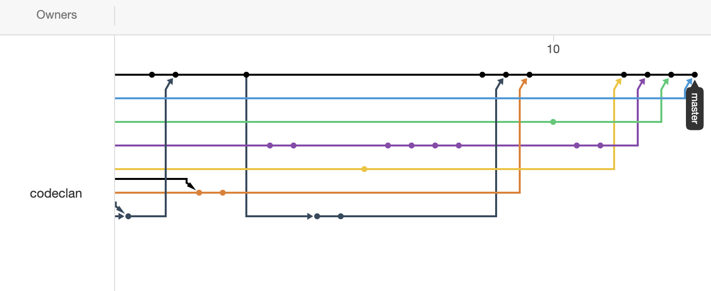
```

# Branches in Practice

Now that we know what a branch is, lets practice using them. In this exercise we'll be working in pairs with each person using their own laptop, but both contributing to a single Git repository. Each partner will make changes to the code and we'll see how to manage any conflicts which occur.

In each pair decide who will be **person 1** and who will be **person 2**. Although only one person needs to be typing at a time, it would be a good idea to make sure both people can see what's happening as you work through the process.

## Person 1

**1)** Create a new repository in Github Desktop called `old_faithful_app`. This time we're going to add a `.gitignore` file when we create the repo to make sure that any local configuration files don't get sent to our partner by mistake. Github Desktop has templates for many languages which include the most commonly ignored files, but we can also make our own additions if we need to. Select `R` from the template drop-down and click create.

<br>

```{r, echo=FALSE, fig.cap="Creating a repo with a `.gitignore`", out.width = '50%'}
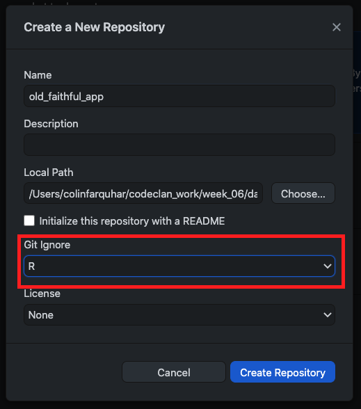
```

<br/>

:::{.emphasis}
Make sure you create the new repository **outside** of any existing ones. Repos inside repos are often a Bad Thing!
:::

<br>

**2)** If Github Desktop hasn't taken care of it for you automatically, **COMMIT YOUR WORK!** We've got the basic setup done, so we should make a commit before we go any further. As a rule of thumb you should commit every time you hit a milestone in your project, even a seemingly small one. More frequent commits mean less code per commit, which makes it easier to see which changes depend on each other.

**3)** Create a file called `app.R` and paste in the code below to set up a basic Shiny app:

```{r, eval=FALSE}
library(shiny)
library(tidyverse)

# Define UI for application that draws a histogram
ui <- fluidPage(

    # Application title
    titlePanel("Old Faithful Geyser Data"),

    # Sidebar with a slider input for number of bins 
    sidebarLayout(
        sidebarPanel(
            sliderInput(inputId = "bins",
                        label = "Number of bins:",
                        min = 1,
                        max = 50,
                        value = 30)
        ),

        # Show a plot of the generated distribution
        mainPanel(
           plotOutput(outputId = "distPlot")
        )
    )
)

# Define server logic required to draw a histogram
server <- function(input, output) {
    
    output$distPlot <- renderPlot({
        # draw the histogram with the specified number of bins
        faithful %>% ggplot(aes(x = waiting)) +
            geom_histogram(bins = input$bins, col = "white", fill = "darkred") +
            xlab("Waiting time (mins)") +
            ylab("Number of eruptions") +
            ggtitle("Histogram of eruption waiting times")
    })
    
}

# Run the application 
shinyApp(ui = ui, server = server)
```

**4)** Make another commit, then publish repository to Github. Send the url to your partner on Slack.

::: {.emphasis}
In order for your partner to submit their own code to this repository it will be necessary for you to grant permission. From the repository page go to Settings -> Manage Access and click the "add collaborator" button. Your partner will receive an email with their instructions in it.
:::

## Person 2

**5)** Go to the link your partner has sent you and clone the repository. Make sure you don't clone it inside another repository! Open the project in RStudio and make sure everything works as expected.

**6)** Back in Github Desktop we're going to create a new feature branch. In a larger project we might create a develop branch first, but for this exercise we don't need it. Click the "current branch" tab in the toolbar, then click "new branch".

<br>

```{r, echo=FALSE, fig.cap="Making a new branch", out.width = '50%'}
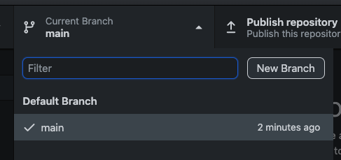
```

<br/>

In the pop-up that appears you can name your branch. We're creating a feature branch here so we'll call it `feature/eruption_length_range_selector`.

Notice that the "current branch" button in the toolbar has changed - it now says `feature/eruption_length_range_selector` under it. We'll see how to switch back to `main` soon.

**7)** Back in `RStudio` open `app.R` for editing and make the changes to the code as shown below to add the eruption length range selector:

```{r, eval=FALSE}
library(shiny)
library(tidyverse)

# Define UI for application that draws a histogram
ui <- fluidPage(

    # Application title
    titlePanel("Old Faithful Geyser Data"),

    # Sidebar with a slider input for number of bins 
    sidebarLayout(
        sidebarPanel(
            sliderInput(inputId = "bins",
                        label = "Number of bins:",
                        min = 1,
                        max = 50,
                        value = 30),
            # ----
            # ADD THIS - double ended range selector
            # ----
            sliderInput(inputId = "eruptionLength",
                        label = "Eruption length (secs):",
                        min = 0,
                        max = 10,
                        value = c(1, 5),
                        step = 0.25),
        ),

        # Show a plot of the generated distribution
        mainPanel(
           plotOutput(outputId = "distPlot")
        )
    )
)

# Define server logic required to draw a histogram
server <- function(input, output) {
    # ----
    # ADD THIS
    # ----
    data <- reactive(
                faithful %>%
                filter(
                  between(eruptions, input$eruptionLength[1], input$eruptionLength[2])
                )
            )
    
    output$distPlot <- renderPlot({
        # draw the histogram with the specified number of bins
        # ----
        # CHANGE THIS TO data()
        # ----
        data() %>% ggplot(aes(x = waiting)) +
            geom_histogram(bins = input$bins, col = "white", fill = "darkred") +
            xlab("Waiting time (mins)") +
            ylab("Number of eruptions") +
            ggtitle("Histogram of eruption waiting times")
    })
}

# Run the application 
shinyApp(ui = ui, server = server)
```

**8)** Test the app and make sure your changes are working. If not, check the error messages carefully to help you fix the bugs. Once your app is working you can add and commit your changes.

**9)** Now we need to merge our changes onto the `main` branch so that our partner can see them. Before we do that we should merge `main` onto our feature branch. That might seem like a strange thing to do, but in a real-life scenario there might have been changes made to main which would interfere with something we've just done and it's better to find out about that before we merge our code.

Click the "current branch" button again. This time you should see a button at the bottom asking you to choose a branch to merge.

<br>

```{r, echo=FALSE, fig.cap="Choosing which branch to merge", out.width = '50%'}
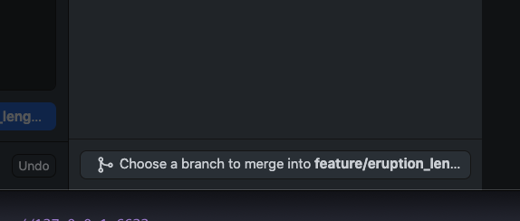
```

<br/>

Clicking that button will bring up a pop-up where we can choose the branch to merge onto our feature branch. We want to merge `main`, so make sure it's highlighted then click the button to make the merge.

<br>

```{r, echo=FALSE, fig.cap="Nothing to merge", out.width = '50%'}
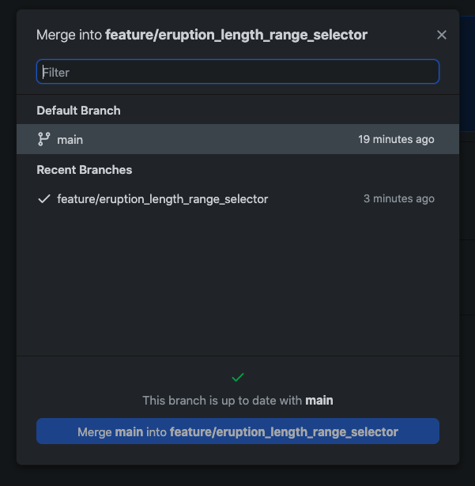
```

<br/>

There's a problem, though. The button can't be clicked and we can see a message above it saying our branch is up to date with `main`. This is actually a good thing: it means there have been no changes on `main` since the branch was created so it's safe to merge the new code onto `main`! Go back to the "current branch" button and select `main` from the list: you're now back on your main branch.

Before going any further, take a look in RStudio again and run the app - all of the changes have disappeared! It might seem a little scary, but this is actually exactly what's supposed to happen. The changes were made on the feature branch, so they only appear in our code when we have "checked out" that branch. Let's pull them over to `main` by revisiting the "select branch to merge" dialog from before:

<br>

```{r, echo=FALSE, fig.cap="Merging to main", out.width = '50%'}
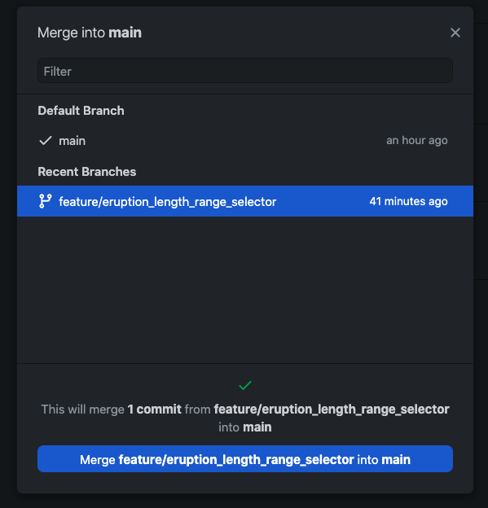
```

<br/>

This time there's a different message saying a commit will be merged. Click the button and the changes from the feature branch will be merged onto `main`. Check in RStudio to make sure everything works as it should.

**10)** Push your code to the remote repository.


## Person 1

**11)** Now it's time to get hold of your partner's changes. Pull the changes in the same way you would for the class notes.

::: {.emphasis}
**This is a bit more theoretical, and not essential to understand!**

<h2>Types of Merging</h2>

Git handles merges in different ways, depending on what's happened to the files it's working with. Each commit is time-stamped and this information is used in figuring out how to process a merge.

The most common (and easiest to work with) is the **fast-forward**. This happens in situations like ours above where we merge a branch into another which has had no new commits since the branch was created from it. In our example we committed to develop, created our branch, worked on it and then merged it back in, but _didn't do anything on develop between creating and merging_. Git knows that all of the commits made on the branch are newer than anything on develop, so merging _fast-forwards_ develop to include the newer commits. This is also what happens every time you `git pull` your class notes, since you're not committing anything locally while the instructors are frequently making changes.

The second type of merge you may see is the **recursive** merge. We would have seen a recursive merge earlier if we had made a commit on develop between creating and merging the branch, _assuming the commits didn't affect the same lines of code_. Git is able to look at the timestamps of the commits, figure out which order changes were made in and reconstruct how the files should look. If commits _do_ affect the same lines we get a merge conflict, which we'll look at next.

```{r, echo=FALSE, fig.cap="There's an xkcd for everything...", out.width = '100%'}
knitr::include_graphics("images/algorithms.png")
```
:::


**12)** We're going to make some small changes to the layout of the app, so create a new branch called `feature/layout_changes`.

**13)** First up we're going to change the colour of the chart:

```{r, eval=FALSE}
#...

 output$distPlot <- renderPlot({
        # draw the histogram with the specified number of bins
        data() %>% ggplot(aes(x = waiting)) +
            # Modify next line
            geom_histogram(bins = input$bins, col = "white", fill = "darkgreen") + 
            xlab("Waiting time (mins)") +
            ylab("Number of eruptions") +
            ggtitle("Histogram of eruption waiting times")
    })

#...
```

Add and commit your changes - remember that we can commit as often as we like, we don't need to wait until we're just about to merge!

**14)** We're also going to make a change to the side panel layout. Replace the appropriate part of your code with the following chunk:

```{r, eval=FALSE}
#...
sidebarPanel(
            sliderInput(inputId = "eruptionLength",
                        label = "Length of Eruption (minutes):",
                        min = 0,
                        max = 10,
                        value = c(1, 5),
                        step = 0.25),
            sliderInput(inputId = "bins",
                        label = "Number of bins:",
                        min = 1,
                        max = 50,
                        value = 30),
            
        ),
#...
```

**15)** Commit your latest changes then merge them to main in the same way as before. Push your changes to Github.


## Person 2

**16)** Before we pull down your partner's changes, we're going to start making more changes of our own. This is fairly likely in a real-world scenario, where every member of the team will have their own list of tasks to work through. Let's imagine we've spotted some mistakes in the slider we added earlier and we need to fix them. Create a new branch to work on called `fix/slider_details`.

**17)** We've changed our mind about what the starting interval should be, and we also want to reduce the number of steps on the slider. There's also the small matter of putting the wrong units on the label (oops!). Modify the sidebar code to look like this:

```{r, eval=FALSE}
sidebarPanel(
            sliderInput(inputId = "eruptionLength",
                        label = "Length of Eruption (minutes):",
                        min = 0,
                        max = 10,
                        value = c(3, 5),
                        step = 0.5),
            sliderInput(inputId = "bins",
                        label = "Number of bins:",
                        min = 1,
                        max = 50,
                        value = 30),
            
          ),
```

**18)** Add and commit the changes.

**19)** Before we merge we're going to switch back to `main` and pull down our partner's changes. Strictly speaking we should have done this with the last merge as well, and you should **definitely** do this going forward. This ensures that we've got the most up-to-date version of the code before we try to merge.

**20)** Let's switch back to our fix branch and merge main into it:

<br>

```{r, echo=FALSE, fig.cap="Uh oh...", out.width = '50%'}
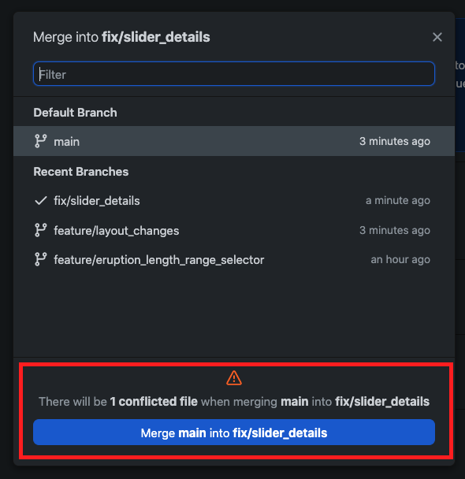
```

<br/>

Oh no, that doesn't look good! Github Desktop is warning us about a potential **merge conflict**, and it has happened because both partners have been working on the same piece of code. If we try to proceed with the merge we'll see a warning like this: 

<br>

```{r, echo=FALSE, fig.cap="Conflicted files", out.width = '50%'}
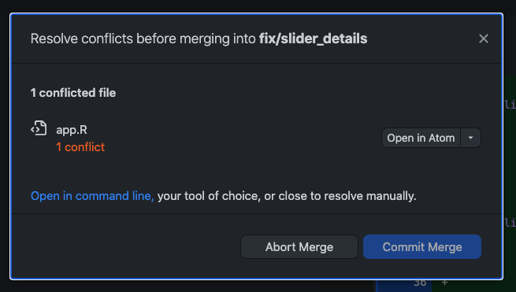
```

<br/>

Git still moves the code over and tries to complete the merge, but won't let us progress until we've sorted out the problem. RStudio should look something like it does in this photo:

```{r, echo=FALSE, fig.cap="Conflict!", out.width = '100%'}
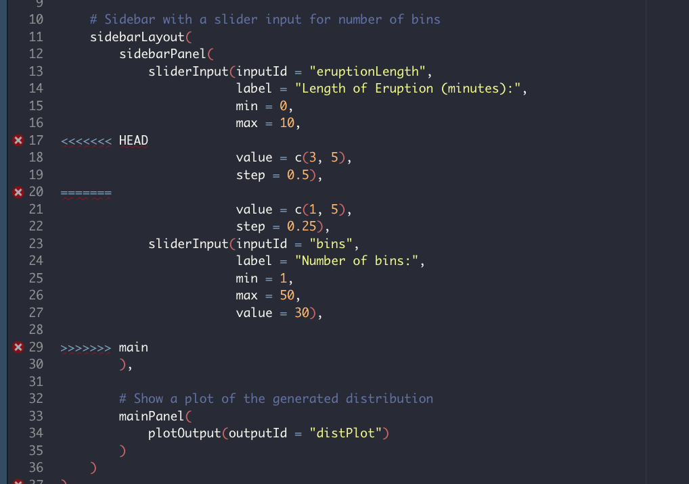
```


## Merge Conflicts

There are a few things to consider here:

- On line 17 there is a row of opening angle brackets and the word "HEAD". This signifies the start of the conflicted part of the code, with our version coming first.
- On line 29 there are right angle brackets and the word "main". The closing brackets tell us where the conflict ends, with "main" letting us know where the conflicting code came from. In our case we merged our `main` branch so the location given is "main", but this could be another branch name (e.g. `feature/layout_changes`) or even a commit ID.
- On line 20 there is a row of equals symbols, acting as a delimiter between the two versions of the code. The easiest way to resolve the conflict is to pick the version either above or below the line and delete the other, and many IDEs and text editors have built-in tools to facilitate this.

```{r, echo=FALSE, fig.cap="The same code, but with Atom giving extra options", out.width = '100%'}
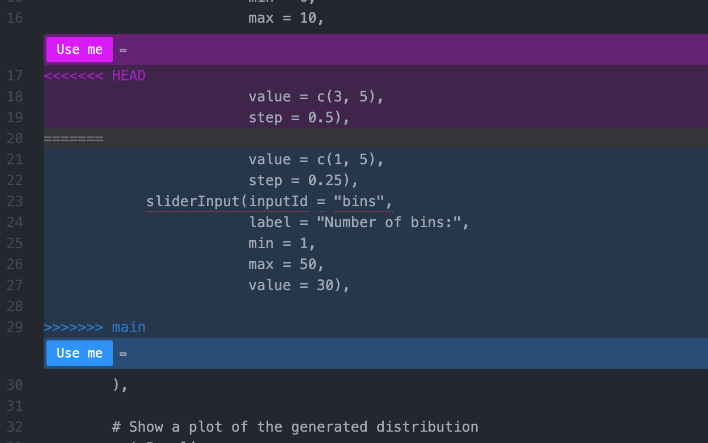
```

Often, though, we won't want to simply throw out a big chunk of code. Merge conflicts arise because two people have been working on the same lines in the file, and while it may be the case that both have been making incompatible changes to the same feature, they could also be adding something completely different and Git doesn't know how to handle it. In that situation we want to keep all of the code, we may even want to mix and match pieces of code from each version. That's what we're going to do here.

::: {.emphasis}
Away from all the conflicts in the UI, take a look down in the server section: Person 1's change to the plot colour has been merged in no problem. Although that code had been changed on the feature branch as well, Git will only highlight the parts which it doesn't know how to merge properly.
:::

Managing, resolving and minimising conflicts is not the responsibility of a single person. Planning and communicating as a team will be critical when it comes to deciding which blocks of code to keep, and indeed in making sure two people aren't working on the same thing in the first place!

## Person 2

**21)** Not all of the changes are causing conflicts, it's specifically the changes to the slider we made. To fix our merge conflict we need to remove the bits we don't want from the **second** block of code, lines 21 and 22 in the image above.

**22)** Our app still won't start, since the lines inserted by Git aren't valid R code and are messing things up. Remove the three lines listed above (`<<<<<< HEAD`, `======` and `>>>>>> main`) and test the app. We should see the colour change and the slider alterations both appearing.

**23)** Now when we check in with Github Desktop we can see that the conflict has been resolved and we can proceed with our merge:

<br>

```{r, echo=FALSE, fig.cap="Conflict resolved!", out.width = '50%'}
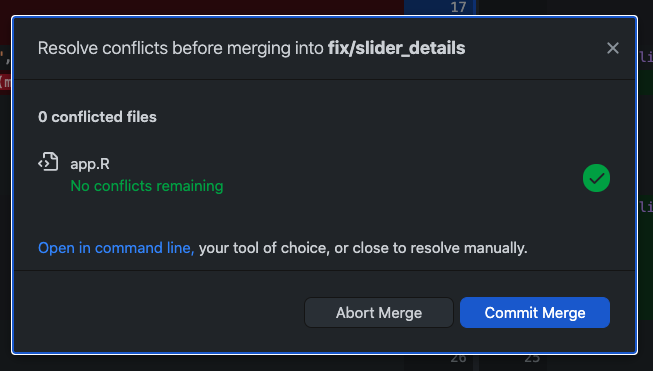
```

<br/>

Clicking the "commit" button automatically makes a commit with a message listing the branches merged.

**24)** Switch back to `main` and merge the fix branch. Once that's done you can push it to Github for your partner to pull down

Congratulations, you have successfully handled your first merge conflict!


# Git Hygiene

Now that we've merged our feature and fix branches there's no need for us to keep them hanging around. If you click the "current branch" button you'll see that it's already getting a bit cluttered, how about we trim some of the excess? To delete a branch we first need to ensure it's our current branch, then select `Branch > Delete` from the menu bar.

<br>

```{r, echo=FALSE, fig.cap="Deleting a branch", out.width = '50%'}
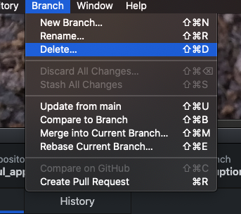
```

<br/>

<br>

```{r, echo=FALSE, fig.cap="**Definitely** deleting a branch", out.width = '50%'}
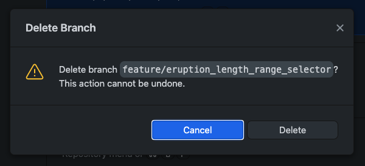
```

<br/>

Note the warning message: **this is permanent**! Once a branch is deleted we can't get it back. In this case we've already merged it to `main` though so our changes are safe, we can go ahead and delete the branch. If we were using a `develop` branch we wouldn't delete it here, since we want it to be available as a starting point for our next feature.

# Doing it all on Github

We can, of course, leverage the tools available online to help us with handling branches. Once a branch has been pushed to Github we can even use it to handle merging, a process known as making a **pull request**. The interface for this has some advantages over doing it using Github Desktop, such as being able to leave comments on specific lines of code and being able to send notifications to contributors asking them to review changes you have made. On the other hand, it's not possible to test the code once any conflicts have been resolved before the merge is completed. More details can be found in the [Github documentation](https://help.github.com/en/articles/about-pull-requests).

# Conclusion

You now have another tool to help your group work together on the upcoming projects. You can now work on new features on separate branches, ensuring that you and your colleagues can work on independent features while still having a functional app available at all times.

<br/>

```{r, echo=FALSE, fig.cap="Please don't do this, though...", out.width = '75%'}
knitr::include_graphics("images/commits.png")
```