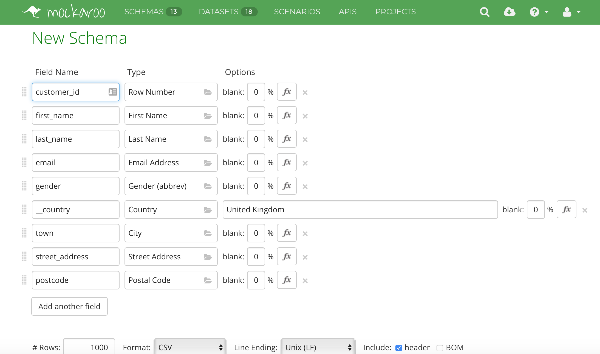
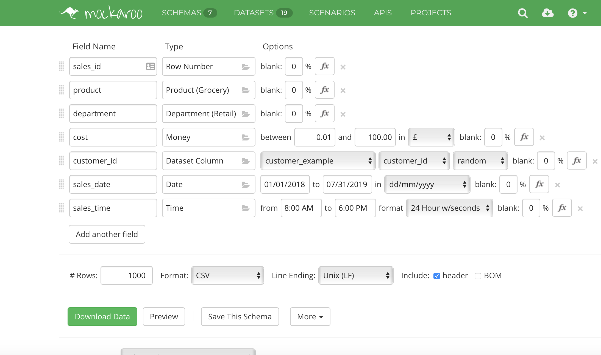
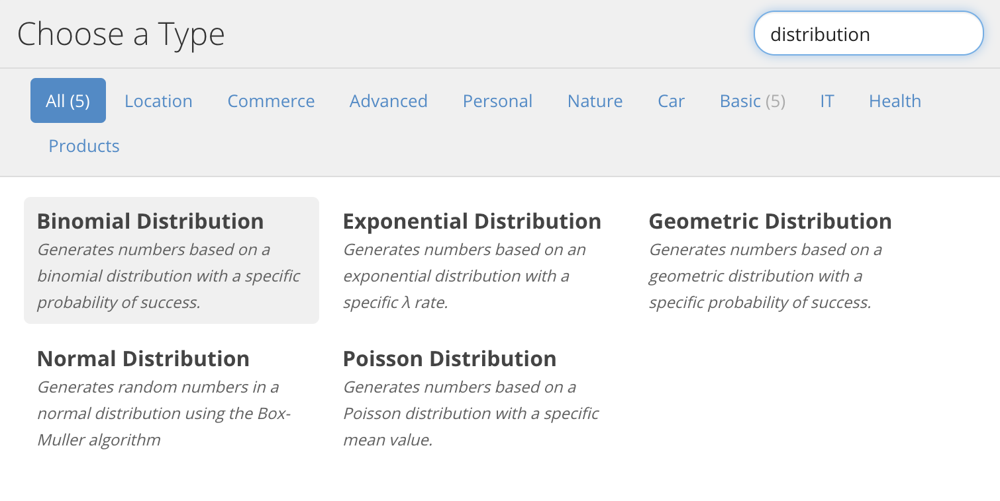
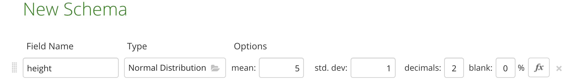
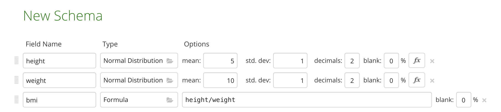

  
```{r setup, include=FALSE}
knitr::opts_chunk$set(echo = TRUE, fig.align = 'center')
```

# Learning Objectives<br>

* Know what synthetic data is
* Know some suitable applications of synthetic data
* Be able to create synthetic datasets

**Duration - 30 mins**<br>

# What is synthetic data?

Synthetic data is often called fake data, test data or simulated data. For today's purposes, we'll use them interchangeably.

The dictionary definition of synthetic data is given below:

<div class='emphasis'>
**Synthetic Data:** any production data applicable to a given situation that are not obtained by direct measurement
</div>
<br>

So, synthetic data is that we've "made up" or "faked" to look like real data.

When we say "looks like real data" we mean that it can be created to mimic real data in a number of ways:

* **Type:** It has the same type eg string, numeric, array, list, table as the real data
* **Format:** The data is formatted in the same way as the real data, be this email address, name, monetary value, currency etc.
* **Range:** The maximum and minimum values of the data can be made to be the same as the real data. It is also possible to push these boundaries to explore the applicability outside normal operating ranges.
* **Distribution:** The data and be made to mimic specific distributions, be they normal, linear, poisson etc. This will ensure that the volumes in bins match the real expected volumes. Again there is also the possibility to mimic slightly different distributions and test the effect this has on model performance.

There are a number of benefits of synthetic data:

* **No usage restrictions:** Real data may have usage constraints due to privacy rules or regulations. Synthetic data can replicate all important statistical properties of real data.
* **Create unencountered conditions:** Where specific situations have not yet been met in the real world, synthetic data is able to create these.
* **No data quality issues:** The synthetic data will only contain the data quality issues you decide to give it. No cleaning or imputing required.
* **Preserves multivariate relationships:** Synthetic data preserves the multivariate relationships between variables instead of specific statistics alone.

# Where is synthetic data used?

There are many valid use cases for synthetic data. The most common ones today are given below, but they will only continue to grow as scenario completeness and privacy become increasingly important.

## Software Testing

When we are testing software we need to create specific scenarios. This normally involves either looking for existing data that meets the specified test case requirements, or creating data that forces the scenario to happen. In the case of brand new software products, there is actually no existing data use, so there is no choice but to create synthetic data.

Often you will find that the development and staging environments have weaker security controls around them, which is another reason why it is not good practice to use production data in these environments.

## Clinical Trials

The use of synthetic data for healthcare is a growing industry. The benefits are obvious: patient confidentiality is maintained, there are no risks to the data being lost, whilst systems can be tested in a full range of scenarios.

There are still challenges around the validity of synthetic data to match real patient data but these are outweighed by the benefits. It is much more cost-effective, more flexible and customisable, whilst ensuring that it is possible to work with really large datasets. The data can also be made available openly and enable anyone with an interest in the topic to use the data to run their own projects. An example is the [Similacrum dataset](https://simulacrum.healthdatainsight.org.uk). This looks and feel like real cancer data.

## Training Machine Learning models

When we are training machine learning models there is the possibility that real data does not cover all the different possible scenarios. If the model has not been exposed to a certain scenario it won't have adapted to deal with that scenario.

The thought may be that want synthetic data to be as close to 'real' data as possible but by generating new data points that aren't the same as 'real' data we can introduce new information that could enrich the training of the model (if that is the purpose of synthesising the data). 

Financial services are already using synthetic data for fraud detection algorithms. This ensures that any personal financial data remains safe, whilst being able to test a wider range of scenarios, but also that the number of labelled fraud transactions is limited and so creating 'fake' fraud transactions can be used for training. 

Autonomous cars are also being trained on similar simulated roads to expand the testing with less risk to the public.

## Data Science Portfolio expansion

Although there are many open data sources out there for budding data scientists to practice their art, with synthetic data the options become endless. The data can be perturbed to introduce noise and models can be built and shared to showcase capabilities without any privacy or confidentiality risks.

For someone looking to expand both their data science capabilities and portfolio, synthetic data is a godsend. It is possible to have both enormous datasets and the required structure and data types to ensure the modelling is able to exhibit the required skills.

 
# How do we create synthetic data?

There are a number of tools you could use - and we will mention 3 in this lesson:

* Using sampling R code to mock up data from scratch 
* Mockaroo - an online tool to mock up data from scratch. 
* R package `synthpop` package (created by researchers at The University of Edinburgh) - used to create data that mimics an original dataset.


# Synthesising using sampling 

Let's take a look at the savings dataset from the `CodeClanData` package:

```{r, warning = FALSE, message=FALSE}
library(tidyverse)
library(CodeClanData)
```

```{r}
head(savings)
```

Let's say we wanted to create some fake data which looks similar to this dataset (but doesn't necessarily follow the patterns of the original data). We can first create a set of a few examples of the character variables; names, genders, job areas and locations.  
```{r}
female_names <- c("Amy", "Bonnie", "Cara", "Dora", "Emmy", "Florence", "Gilly", "Helena", "India", "Jools")
male_names <- c("Angus", "Bert", "Charles", "Donald", "Ed", "Freddy", "Gord", "Harry", "Ivan", "Jimmy")
all_surnames <- c("Smith", "Taylor", "McKay", "Williams", "Cameron", "Jones")
all_genders <- c("Male", "Female")
all_job_areas <- c("Human Resources", "Sales", "Product Management", "Training", "Legal")
all_locations <- c("Edinburgh", "Glasgow", "Shetland", "Stirling", "Inverness", "Aberdeen", "Orkney", "Western Isles")
```

We can then use the `sample` function to sample each of these examples, with replacement. We can use random generator functions discussed during stats week, with the distribution chosen depending on what kind of variable it is (height/weight/age will likely be normal, where as salary may be more likely to follow a Poisson distribution). Below is an example of how it can be done but we use different distributions and different parameters. 

```{r}
data_size <- 1000

savings_fake <- tibble(
  gender = sample(all_genders, data_size, replace = TRUE),
  name = if_else(gender == "Female",
                 sample(female_names, data_size, replace = TRUE),
                 sample(male_names, data_size, replace = TRUE)),
  surname = sample(all_surnames, data_size, replace = TRUE),
  job_area = sample(all_job_areas, data_size, replace = TRUE),
  salary = rpois(data_size, 20)*1000,
  age = runif(data_size, 18, 90) %>% round,
  retired = if_else(age > 65, "Yes", "No"),
  location = sample(all_locations, data_size, replace = TRUE),
  savings = 0.5*salary + (retired == "No")*20000 + 200*age + rnorm(data_size, sd = 10000) %>% round()
)

head(savings_fake)
```

This can be particularly handy for generating sensitive variables, such as names, which we wouldn't want to do using synthpop because it would still include the 'real' names, from the original data. 

# Mockaroo

There are also online tools to synthesise data. The most commonly used one is [Mockaroo](https://mockaroo.com). This has an almost unlimited library of different formats and more importantly allows you to create self-consistent data across multiple tables. For example, if you had a customer table with a customer_id and a sales table with a link to the customer_id of the customer that bought that product, then the sales table would contain valid customer_ids.

The only limitation to Mockaroo for the free plan is that only 1000 rows can be downloaded per query.

## Using Mockaroo to create our own data

We are going to create a customer table containing customer_id, first_name, last_name, email_address, gender (M/F) and address fields for UK addresses.

```{r, echo=FALSE, out.width = '80%'}

```
<br>

The nice thing about Mockaroo is that there is self-consistency between some of the fields. Female names give female genders, UK country gives UK town names.
To get a UK place name, you need to create a country field, above where it will be used. However, if you don't want this field in your final output, put two underscores `__` before the field name and it will be missed out.

To create self-consistent links between tables, the schema needs to be saved and the related dataset downloaded. The dataset then needs to be uploaded and saved as a dataset in your Mockaroo account. 

When creating the new table, set the variable type set to "Dataset Column", where the dataset and column can then be selected.

<blockquote class='task'>
**Task - 10 mins** 

Create a Mockaroo account.

Create a sales table, linked to the customer table containing:

* sales_id
* product
* department
* cost (in £s)
* customer_id
* sales_date
* sales_time

Remember the date must be in the past and the customer_id should be consistent with the customer table.

<details>
<summary>**Example Answer**</summary>

```{r, echo=FALSE, out.width = '100%'}

```

</details>
</blockquote>

A few other things to point out about Mockaroo: 

* You can use it to mock an API (more info https://mockaroo.com/mock_apis)
* You can specify that want a variable to follow a particular distribution, by selecting this as the variable type:

```{r, echo=FALSE, out.width = '80%'}
  
```

And then you can specify the distribution parameters, such as mean and standard deviation:

```{r, echo=FALSE, out.width = '80%'}
  
```

* You can specify formulas (like rules in synthpop), where you can use other fields as part of your formula. For example

```{r, echo=FALSE, out.width = '80%'}
  
```

When you specify the variable type as 'Formula' and it provides a helpful list/explanation of different formulas you can use. 

# Synthpop 

You may need your data to mimic your original dataset. The link to the package CRAN page is [here](https://cran.r-project.org/web/packages/synthpop) and it is introduces as:

> *A tool for producing synthetic versions of microdata containing confidential information so that they are safe to be released to users for exploratory analysis. The key objective of generating synthetic data is to replace sensitive original values with synthetic ones causing minimal distortion of the statistical information contained in the data set.*

We won't be covering it in today's lesson but if you do want to learn more about it then [here](https://www.r-bloggers.com/generating-synthetic-data-sets-with-synthpop-in-r/) is a handy blog article with a use example. 


# Recap

What parameters help to define synthetic data?
<details>
<summary>**Answer**</summary>
Type, format, range and distribution
</details>

What are the benefits of using synthetic data for software testing?
<details>
<summary>**Answer**</summary>
More secure and real-data may not exist for required scenarios
</details>

What package can you use in R to synthesise data?
<details>
<summary>**Answer**</summary>
`synthpop`
</details>

What steps do we need to undertake to create linked tables in Mockaroo?
<details>
<summary>**Answer**</summary>

* Save the schema
* Download the dataset
* Upload the dataset
* Use the Dataset Column type to select the dataset and variable to link
</details>

# Additional resources

* [Waymo: driverless car simulation data](https://www.theverge.com/2018/7/20/17595968/waymo-self-driving-cars-8-million-miles-testing)

`synthpop`

Mockaroo

* [Mockaroo website](https://mockaroo.com)

* [Mockaroo training YouTube channel](https://www.youtube.com/playlist?list=PLKMZcxOsC3u0Y-4CHg5SDpVjTcrvGttTt)


