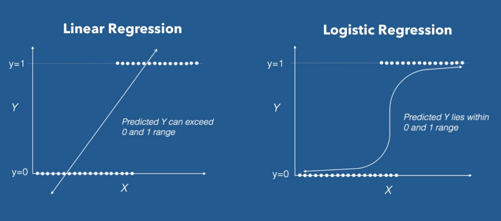
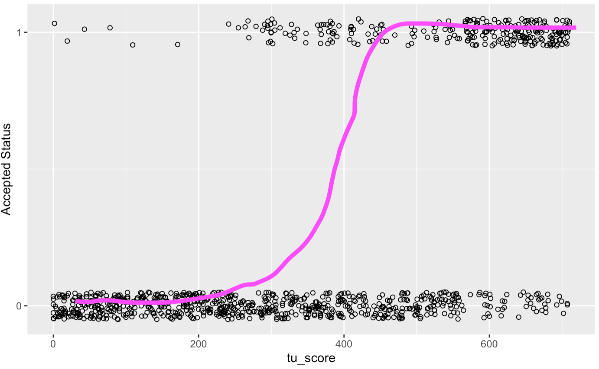
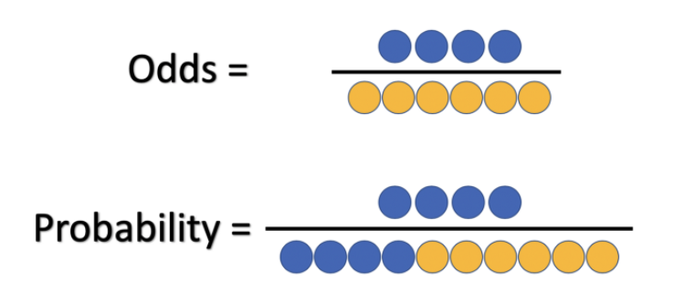
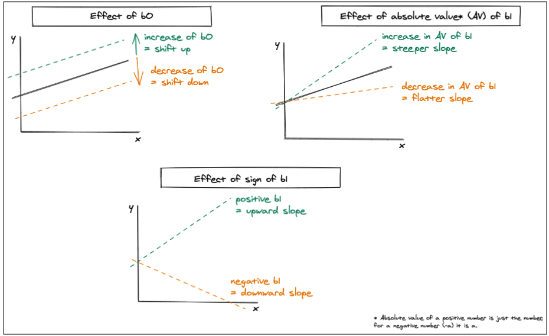
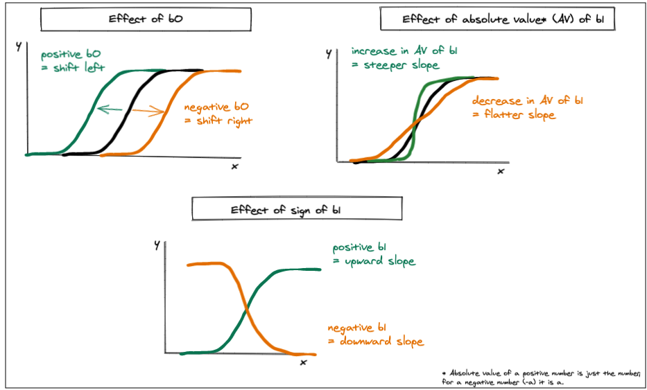

```{r setup, include=FALSE}
knitr::opts_chunk$set(echo = TRUE, fig.align = 'center')
```


# Learning Objectives

* Understand what logistic regression is, and what it is used for
* Be able to describe real-world applications of logistic regression
* Know what a logistic function looks like
* Understand the logistic formula

**Duration - 60 minutes**

*** 

# What is Logistic Regression?

So far, our regression fits have all involved a **continuous** dependent variable (AKA an outcome variable where the measurement is on a continuous scale, such as weight, time, and length).  

But we know that this isn't the only data we can have. What would we do when we have a **binary** (AKA 'dichotomous' dependent variable where the measurement can only take on two values (0 or 1) at each observation).**
  
Well, we would use something called **logistic regression**. Logistic regression is the appropriate analysis technique to use when the dependent variable is binary.  Typically it's a coding of something qualitative (e.g. married versus not married, approved for a loan versus not approved) which can be represented as `0` and `1`. It is a predictive analysis used for classification problems, and used to describe the data and explain the relationship between the dependent binary variable and one (or more) explanatory independent variables. It is a technique that can be used for traditional statistical analysis, as well as machine learning. 

***

# Logistic Regression: The Variables

Let's look at some data where this modelling requirement arises quite naturally. We want to build a model linking various attributes of mortgage applicants to the **final status** of their application (i.e. whether it was accepted or declined, a binary dependent variable). 

We've gathered data from 1000 recent applications. Let's have a look at it now.

<br> 

```{r, message=FALSE, warning = FALSE}
library(tidyverse)
library(janitor)

mortgage_data <- read_csv("data/mortgage_applications.csv") %>%
  clean_names()
              
head(mortgage_data)
```

Here `tu_score` stands for 'TransUnion score', a credit score that ranges from 0 to 710; `employed` and `age` are self explanatory; and `accepted` is the binary dependent variable denoting final application status: `TRUE` is accepted, `FALSE` is not accepted. 

The output of the `ggpairs()` function in the `GGally` package can be useful to investigate the relationships between a binary dependent and the various possible continuous or categorical independent variables.

```{r, message=FALSE, warning = FALSE}
library(GGally)
ggpairs(mortgage_data)
```


Let's ignore the `employed` and `age` variables for the moment and focus on `tu_score` and how it relates to the `accepted` column, as this is really the main relationship we are interested in. Focussing on the `accepted` column, we see that it shows a strong relationship with `tu_score`, and there is also a significant relationship between `employed` and `accepted` (in that, if you are employed, your probability of being accepted is approximately 0.5, whereas if you are unemployed, you have a much smaller probability of acceptance). The `accepted` probability seems not to vary significantly with `age`. We also see a significant relationship between `employed` status and `tu_score`.

_Note that numerical correlation values are mostly absent in this plot, due to the fact that we have only one pairing of numerical variables: `tu_score` and `age`. If you really want or need a numerical measure, consider using the **point-biserial correlation** rather than the standard Pearson correlation you have been using up until now._

Direct visualisation is arguably more useful when investigating the relationships between continuous and binary variables. Let's plot the relationship between `tu_score` and `accepted`:

```{r}
# Let's reduce the symbol size and 'jitter' the y-values so we can see more of the data without overlap of symbols
# geom_jitter() adds adds a small amount of random variation (vertically and/ore horizontally depending on the arguments) to the location of each point

score_plot <- ggplot(mortgage_data) +
  geom_jitter(aes(y = tu_score, x = as.integer(accepted)), shape = 1, 
              position = position_jitter(width = 0.05)) + 
  xlab("Accepted Status") + scale_x_continuous(breaks=seq(0, 1,1))

score_plot
```

So we see we have two outcomes (0 and 1) and we can see that the distribution of the data points within those are different. Loans that aren't accepted (`accepted = 0`) are equally distributed across the `tu_score`, while loans that are accepted (`accepted = 1`) are mostly distributed around the higher `tu_score`. 

The question is: how do we model this data? Is a simple linear regression a good idea? Let's see...


```{r, message = FALSE}
mortgage_data_lin_model <- lm(as.integer(accepted) ~ tu_score, data = mortgage_data)

# The modelr package provides functions that help you create elegant pipelines when modelling. We will use the add_prediction() function from modelr to add a variable adding predictions based on another variable in the dataframe. 
library(modelr)

predict_lin <- tibble(tu_score = seq(0, 710, 1)) %>%
              add_predictions(mortgage_data_lin_model)


score_plot + 
   geom_line(data = predict_lin, aes(x = pred, y = tu_score), col = 'red')
```

Erm, no. This is a terrible fit. We can view the regression line as an (albeit rubbish) attempt to estimate *how the mean probability of getting a mortgage application accepted varies with `tu_score`*.

To see this, imagine we focus on one `tu_score` value, say 594, and then look at the outcomes for that value. 

```{r}
mortgage_data %>%
  filter(tu_score == 594)
```

So, three applications accepted and two declined for this score. This suggests that the empirical probability of being accepted at this score $p(\textrm{tu_score = 594}) = 0.6$ (3 out of 5 options). 

The linear regression will try to provide a set of best-estimates $\widehat{p}(\textrm{tu_score})$ across the range of independent variables. But, the $\widehat{p}$ values predicted by the model are not satisfactory. For a start, the regression clearly does not fit the data very well. 

Secondly, because linear regression extrapolates, it technically means it could fit a line beyond 0 and 1, which is not possible if we only have two outcomes. So we need a better model to fit to this data, a model that generates probabilities within the proper bounds. This is where the **logistic function** comes in!

You can see in this mock up, why a model that is limited between 0 and 1 can provide a better fit for data with binary outcomes, as you won't get any impossible extrapolated values! 

<br>

```{r, echo=FALSE, fig.cap="Image: Data Camp", out.width = '100%'}

```

<br> 


*** 

# Logistic Regression: The Assumptions

The same rules apply when using logistic regression as other types: you must check your assumptions before you start. The major assumptions for logistic are:

  * The dependent variable should be binary in nature  
  * There needs to be no outliers in the data 
  * There should be no high correlations between the predictors  

Again, thankfully these aren't too different than what we looked at for linear regression, so you should be ok with these. 

<br>

*** 

# Logistic Regression: The Fit

So we've seen what kinds of variables we'd work with, and we've seen what the resulting model *should* look like. 

The logistic function is used for classification problems, to predict the probability of an outcome that can only have two values (i.e. 0 or 1, yes or no, true or false, spam or not, healthy or not, etc.). To do this, the function essentially "mathematically squeezes" the output of a linear equation between 0 and 1, to produce an S-shaped curve (as we saw above). It does this by fitting a logistic function to the data. This S-shaped curve can take any real-valued number and map it to a value between 0 and 1, so it stays within the bounds. This shows you the probability of each data point within your two binary outcomes. 

As we saw above, it looks like so:


```{r, echo=FALSE, fig.cap="", out.width = '50%'}
knitr::include_graphics("images/logistic_function.png")
```

Although it tells you the probability of an event, it is usually used for classification instead. For example, you may say that data points that have a greater than 0.5 probability belong to one category, while those with less than 0.5 belong to another. 

Let's plot our data again to see if potentially an S-shaped curve would be more promising fit than the straight line of simple linear regression we saw above. 

For this, let's switch the axis around, so we can visualise the outcomes easier and compare to the plot above:

```{r}
ggplot(mortgage_data) +
  geom_jitter(aes(x = tu_score, y = as.integer(accepted)), shape = 1, 
              position = position_jitter(h = 0.05)) + 
  ylab("Accepted Status") + scale_y_continuous(breaks=seq(0, 1,1))
```

So, we can see here that an S-shape might be more useful if we overlay a rough S shaped curve:


```{r, echo=FALSE, fig.cap="", out.width = '100%'}

```
The bulk of the data lies on the two tail ends of the S curve, which suggests that a logistic model is a better fit for the data. Yay. 

***

# Logistic Regression: The Function
  
So, we know what the fit looks like, and what data we are modelling and what assumptions we have. But how do we get there? 

At the center of the logistic regression analysis is the task estimating the **log odds of an event, rather than the probability**. In very simplistic terms, log odds are an alternate way of expressing probabilities. 

In order to understand log odds, it’s important to first understand a key difference between odds and probabilities: odds are the ratio of something happening to something not happening, while probability is the ratio of something happening to everything that could possibly happen.

For example, if a football team plays ten games, and wins four of them then the odds of winning are $4:6$ (successes:failures, happening:not happening). However, the probability is $4/10$ (as there were 10 games total played, and four won). 
<br>

```{r, echo = FALSE, out.width='60%'}

```

<br>

You can mathematically represent this as: 

<br>

$$\textrm{odds}_\textrm{success}(x)=\frac{\widehat{\textrm{prob}}(x)}{1-\widehat{\textrm{prob}}(x)}$$

<br>
For example, if we toss a fair coin, the odds of 'getting a head' are one-to-one $1:1 = \frac{1}{1}=1.0$. 


The TL;DR is that **odds essentially describes the ratio of success to the ratio of failure**. 

<br> 

<blockquote class='task'>
**Task - 2 mins** 

If we roll a fair die, what are the **odds** of getting a 6?
<br>

<details>
<summary>**Details**</summary>

The probability of success is $\textrm{prob} = \frac{1}{6}$ and the probability of failure is therefore $1-\textrm{prob} = \frac{5}{6}$, so the odds are
$$\textrm{odds}(\textrm{success}) = \frac{\frac{1}{6}}{\frac{5}{6}} = \frac{1}{5} = 0.2$$

</details>
</blockquote>


The **log odds** is nothing but **log of odds**, i.e., `log(odds)`. A logarithmic scale (or log scale) is a way of displaying numerical data over a very wide range of values in a compact way—typically the largest numbers in the data are hundreds or even thousands of times larger than the smallest numbers. Such a scale is nonlinear: the numbers 10 and 20, and 60 and 70, are not the same distance apart on a log scale. Rather, the numbers 10 and 100, and 60 and 600 are equally spaced. Thus moving a unit of distance along the scale means the number has been multiplied by 10 (or some other fixed factor).

Using the `log(odds)` in our calculations helps us make the distance from origin (0) same for both odds, i.e, winning (favor) and losing (against). This can be useful when you have vastly different scales between winning and losing (or any two outcomes) as it makes equal distances and therefore makes the data more symmetrical. 


How does this feed into logistic regression? logistic regression uses an equation as the representation, very much like linear regression. In the linear regression model, we have modelled the relationship between outcome and features with a linear equation:

<br> 

$$\widehat{y}=b_0+b_1* x$$
<br>

For logistic regression, we wrap the right side of the equation in the logistic function. The logistic function is the inverse of the natural logit function and so can be used to convert the log odds into a probability, which forces the output to be between 0 and 1:

We can represent this as:

<br> 


$$\widehat{\textrm{prob}}(x)=\frac{1}{1+e^{-(b_0+b_1 \times x)}}$$

<br> 


We don't need to know the in depth step-by-step process behind the maths for this, but you should be aware that in logistic regression,  data is fit into linear regression model, which then be acted upon by a logistic function. Every probability or possible outcome of the dependent variable can be converted into log odds by finding the odds ratio and applying the logistic function. The log odds logarithm (otherwise known as the logit function) uses a certain formula to make the conversion. 

We can formalise this equation as:

<br>

$$\ln(\textrm{odds}_\textrm{success}(x)) = b_0 + b_1 \times x $$

<br> 

Hopefully, this is something very much like we're used to seeing in linear regression. Don't worry too much about the fact we have $\ln(\textrm{odds}_\textrm{success}(x))$ on the left-hand side, this equation is basically of the form:

<br>

$$\widehat{y}=b_0+b_1 \times x$$
<br> 

Written this way, it looks a lot like what we saw with linear regression, right? The main differences is that in linear regression we saw that the value of $b_0$ affected where the intercept of the line was and $b_1$ affected the slope. In the logistic regression the constant ($b_0$) moves the curve left and right and the slope ($b_1$) defines the steepness of the curve. In logistic regression, we use this model to give us best fit values for $b_0$ and $b_1$ based on the data. 


The **log-odds** function on the left hand side ($\widehat{y}$ or $\ln(\textrm{odds}_\textrm{success}(x))$) is also known as the **logit** function (pronounced 'low jit' or 'law jit' with a soft 'g'):

<br>

$$\textrm{logit}(\widehat{\textrm{prob}}(x))= \ln \big(\textrm{odds}_\textrm{success}(x) \big)=\ln \Big( {\frac{\widehat{\textrm{prob}}(x)}{1-\widehat{\textrm{prob}}(x)}} \Big) $$
<br>

These all equal the same (just written in different ways) and we end with the logit function:

<br>

$$\ln \Big( {\frac{\widehat{\textrm{prob}}(x)}{1-\widehat{\textrm{prob}}(x)}} \Big)$$
<br> 

which hopefully ties into what we've recapped about how odds and probabilities relate. The log odds of the event is the log of the odds (which is success:failure). **The log odds is the probability of event divided by probability of no event.** 


Let's see what this looks like when we plot it:

```{r}
logit <- function(x){
  return(log(x/(1-x)))
}

logit_data <- tibble(p = seq(0.001, 0.999, 0.001)) %>%
  mutate(logit_p = logit(p))

head(logit_data)
```

```{r}
ggplot(logit_data, aes(y = p, x = logit_p)) + 
  geom_line() + 
  ylab("probability") + xlab("logit(p) value")
```

So $\textrm{logit}(p)$ provides the link between a continuous independent variable, which could take really large positive or negative values and a probability in the range $0 \le p \le 1$. To see this, note that any $\textrm{logit}(p)$ value on the graph above gives a $p$ in the correct range, because we can't get probabilities less than 0 or bigger than 1.


In reality you don't need to be fully aware of the ins and outs of all the maths on how we get from the odds to fitting a logistic regression curve, but we have included the step by step guide to the function, if you're interested. 

<br>

<div class='emphasis'>
<details>
<summary>**If you are interested in the mathematical steps to calculate the logistic function, you can find these here. **</summary>

<br><br> 

**Step 1 : Define our probability function**

First, we start with our function for the estimated probability:

$$\widehat{\textrm{prob}}(x)=\frac{1}{1+e^{-(b_0+b_1 \times x)}}$$

Where:

- $\widehat{\textrm{prob}}(x)$ : the probability of our value (output of the function)
- $e$ : Euler's number (the base of the natural logarithms)
- $1$ : The curve maximum (as it has to be between 0 and 1) 
- $b_0$ : the constant
- $b_1$ : the slope
- $x$ : independent variable (continuous value)


And our aim is to get this equation **linear** (i.e. 'get $b_0$ and $b_1$ out of the exponent and 'onto the line'). To get there we will use the 2 equations above and a bit of mathematical rearrangement. 

<br><br>

**Step 2:  We rewrite the probability in terms of the odds**

We rewrite our definition of odds from step 1 so that it is probability in terms of the odds (i.e. we have $\widehat{\textrm{prob}}(x)$ on the left hand side).

We save ourselves some effort, and just write $\textrm{odds}_\textrm{success}(x)$ as $\textrm{odds}$, and $\widehat{\textrm{prob}}(x)$ as $\widehat{\textrm{prob}}$. Multiplying both sides of the equation above by $1-\widehat{\textrm{prob}}$ we get

$$(1-\widehat{\textrm{prob}}) \times \textrm{odds} =  \widehat{\textrm{prob}}$$

so that

$$\textrm{odds} - \widehat{\textrm{prob}} \times \textrm{odds} = \widehat{\textrm{prob}}$$

and then

$$\textrm{odds} = \widehat{\textrm{prob}} \times (1+\textrm{odds})$$

so finally

$$\widehat{\textrm{prob}} = \frac{\textrm{odds}}{1+\textrm{odds}}$$
<br>

If we follow all the steps hidden in the above drop down, we end up with:

$$\widehat{\textrm{prob}} = \frac{\textrm{odds}}{1+\textrm{odds}}$$

<br><br>

**Step 3: Substitute in our function for the estimated probability**

Remember the logistic function above for $\widehat{\textrm{prob}}$:

$$\widehat{\textrm{prob}}(x)=\frac{1}{1+e^{-(b_0+b_1 \times x)}} $$

We substitute this in for $\widehat{p}$ that we got in step 2:

$$\frac{1}{1+e^{-(b_0+b_1 \times x)}} = \frac{\textrm{odds}}{1+\textrm{odds}}$$


<br><br>

**Step 4: Make it linear**

Now we try to make this equation **linear** (i.e. 'get $b_0$ and $b_1$ out of the exponent and 'down on the line').

Cross multiplying we get 

$$1+\textrm{odds} = \textrm{odds} \times (1+e^{-(b_0+b_1 \times x)}) = \textrm{odds} + \textrm{odds} \times e^{-(b_0+b_1 \times x)}$$

and then subtracting $\textrm{odds}$ from both sides we get

$$1 = \textrm{odds} \times e^{-(b_0+b_1 \times x)}$$

So that

$$\textrm{odds} = \frac{1}{e^{-(b_0+b_1 \times x)}} = e^{b_0+b_1 \times x}$$

We are nearly there! Let's remind ourselves of the full definition of $\textrm{odds}$, and think about how to make the expression above **linear** in $b_0$ and $b_1$. Here's where we've got to

$$\textrm{odds}_\textrm{success}(x) = e^{b_0+b_1 \times x}$$

We want to 'undo' the exponential, so let's take the $\ln()$ of both sides

$$\ln(\textrm{odds}_\textrm{success}(x)) = \ln(e^{b_0+b_1 \times x}) = b_0 + b_1 \times x$$
<br>

So we end up with

<br>

$$\ln(\textrm{odds}_\textrm{success}(x)) = b_0 + b_1 \times x $$

i.e. the natural logarithm of the odds of success equals something very much like we're used to seeing in linear regression. Consequently, this is a linear function: $b_0$ and $b_1$ are down 'on the line'! Don't worry too much about the fact we have $\ln(\textrm{odds}_\textrm{success}(x))$ on the left-hand side, this equation is basically of the form:

$$\widehat{y}=b_0+b_1 \times x$$

</details>
</div>

<br>

<br>

*** 

# Logistic Regression: The Interpretation

In simple linear regression ($\widehat{y}=b_0+b_1 \times x$), the interpretation of $b_1$ was straightforward: if the independent variable $x$ increases by one unit, then the estimate of the dependent variable $\widehat{y}$ changes by $b_1$ units, increasing or decreasing as $b_1$ is positive or negative, respectively.

The interpretation of $b_1$ in logistic regression is a little bit more complicated, due to the fact that we're using the *log-odds* as the dependent variable and since the outcome in logistic regression is a probability between 0 and 1. A lot of people (us included) find the interpretation of the weights more tricky because the change is multiplicative and not additive.

In terms of interpreting this, you should think of it as **a change in $x$ by one unit increases the log odds ratio by the value of the corresponding weight. For example, if you have `odds of 2`, it means that the probability for `y=1` is twice as high as `y=0`.

We saw in simple linear models what effects the estimated coefficients (intercept and slope) had on the visualisation of the line of best fit, below we recap this as well as showing what effects the estimated coefficients in a logistic model have when visualising the logistic curve.

<br>


<center>**Simple Linear Regression**</center>
<br>

```{r, echo=FALSE, fig.cap="", out.width = '100%'}

```

<br>

<center>**Simple Logistic Regression**</center>
<br>

```{r, echo=FALSE, fig.cap="", out.width = '100%'}

```


We'll come back to the issue of interpretation after we've run a logistic regression.


# Recap

<br>

* Why can't we use simple linear regression to model the relationship between a dichotomous response and a continuous predictor variable?
<details>
<summary>**Answer**</summary>
Aside from not fitting the data particularly well, the linear regression can predict outcomes greater than 1 or less than zero, which is problematic if we interpret the sample responses as probabilities.
</details>

<br>

* What is the form of the fitting function used in logistic regression? Why do we use this function?
<details>
<summary>**Answer**</summary>
We use the logistic function
$$f(x)=\frac{1}{1+e^{-k \times (x-x_0)}}$$
because it maps correctly from a continuous variable to a probability. It never exceeds 1 nor falls below 0. 
</details>

<br>

* What is the definition of the 'odds' of an event?
<details>
<summary>**Answer**</summary>
$$\textrm{odds}_\textrm{success}(x)=\frac{\widehat{\textrm{prob}}(x)}{1-\widehat{\textrm{prob}}(x)}$$
</details>

<br>

* What is the definition of the 'logit' function? Why does it occur in logistic regression?
<details>
<summary>**Answer**</summary>
The 'logit' takes the form
$$\textrm{logit}(\widehat{p}(x))= \ln \big(\textrm{odds}_\textrm{success}(x) \big)=\ln \Big( {\frac{\widehat{\textrm{prob}}(x)}{1-\widehat{\textrm{prob}}(x)}} \Big)$$
It occurs in logistic regression because it describes the form in which the model becomes linear.
</details>

<br>

</details>

<br>
