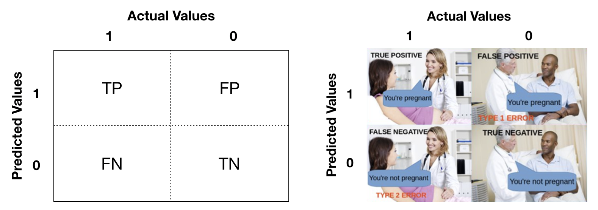
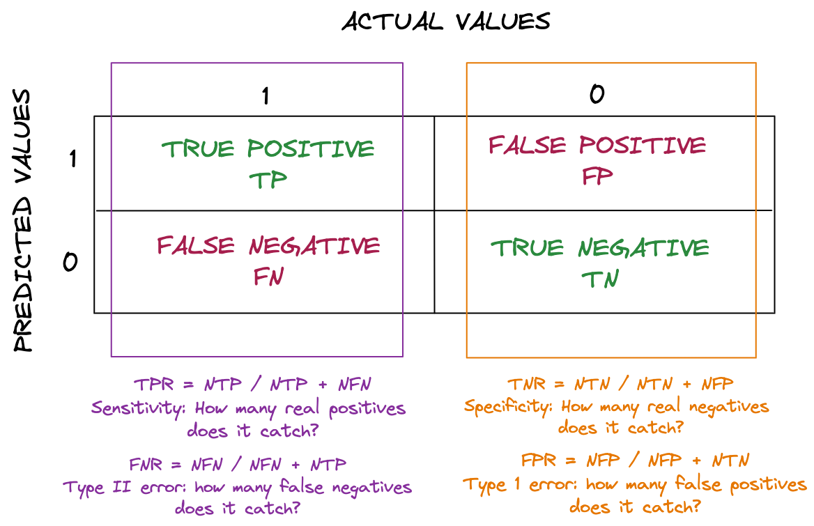

```{r setup, include=FALSE}
knitr::opts_chunk$set(echo = TRUE, fig.align = 'center')
```
# Learning Objectives

* Be able to check for statistical significance of fitted coefficients via their p-values.
* Be able to calculate a confusion matrix to calculate accuracy, and true and false positive rates 

<hr>

# Logistic regression performance

How can we tell whether a logistic regression model is doing a good job of fitting data? Remember that the input data for logistic regression has binary values for the dependent variable, but we've seen that the model outputs **estimated probabilities**. How do we use these values?

It turns out we've nearly finished creating what data scientists call a **binary classifier**! Just one final ingredient is necessary: we have to set a **threshold probability** above which we say the model predicts `TRUE` or `1` for the binary outcome, and below which it predicts `FALSE` or `0`.

Let's see this in action to understand the process.

<blockquote class='task'>
**Task - 5 mins - Preparation**  

* Load and clean the names of `mortgage_applications.csv`.
* Re-run the logistic regression on the dataset, again treating the `tu_score`, `age` and `employed` variables as predictors and the `accepted` variable as the binary dependent. 
* Keep the model object (call it `mortgage_3pred_model`) and use it to predict estimated probabilities for the sample data using `add_predictions()` (call this `mortage_data_with_3pred`) 
* Look as the `head()` of the data with predicted probabilities.

<details>
<summary>**Solution**</summary>
```{r, warning = FALSE, message = FALSE}
library(tidyverse)
library(modelr)
library(janitor)

mortgage_data <- read_csv("data/mortgage_applications.csv")
mortgage_data <- clean_names(mortgage_data)

mortgage_3pred_model <- glm(accepted ~ tu_score + employed + age, data = mortgage_data, family = binomial(link = 'logit'))

mortgage_data_with_3pred <- mortgage_data %>%
  add_predictions(mortgage_3pred_model, type = "response")
head(mortgage_data_with_3pred)

summary(mortgage_3pred_model)
```
</details>
</blockquote>

<br>
<div class='emphasis'>
The problem is that fitted values from the regression model are probabilities, so we can't really compare whether or not it has correctly predicted the loan response (`TRUE/FALSE`). To compare these with the sample data we need to choose a **threshold probability** above which we say a mortgage application is predicted to be **accepted**, and below which it's predicted to be **declined**.
</div>
<br>

Let's do this with a threshold probability say of $0.6$.

```{r}
threshold <- 0.6
mortgage_data_with_3pred <- mortgage_data_with_3pred %>%
  mutate(pred_thresh_0.6 = pred >= threshold)

head(mortgage_data_with_3pred, 10)
```

This looks reasonably promising, but now we'd like to count how often our classifier is correct (with reference to the sample `accepted` values), and how often it is incorrect. The simplest way to do this is by calculating and inspecting the **confusion matrix**

<hr>

# Confusion matrix.

Let's calculate and show the confusion matrix for this problem and then discuss its details.

```{r}
conf_table <- mortgage_data_with_3pred %>%
  tabyl(accepted, pred_thresh_0.6)

conf_table
```

To explain this table: 

* The 'correct' predictions, i.e. **true negatives** and **true positives** are on the *top left to bottom right diagonal*.
* The 'incorrect' predictions, i.e. **false negatives** and **false positives** are on the *bottom left to top right diagonal*. A perfect classifier would have zeroes on this diagonal.

'True', 'false', 'negative' and 'positive' can be confusing terms at first. It might help to think that 'negative' and 'positive' are the outcomes **predicted by the logistic regression** and 'true' and 'false' relate to whether the prediction was correct with reference to the sample data.

<br> 

```{r, echo = FALSE, out.width = '100%'}

```

<br> 

Another way to remember it: if the actual value is **positive** (i.e. TRUE or 1), then your predicted value is either going to be a **true positive** or a **false negative** - because it can either be predicted correctly or incorrectly. 
If your actual value is **negative**  (i.e. FALSE or 0) then your predicted value is either going to be a **false negative** or a **true negative** - because it can either be predicted correctly or incorrectly.

For example, in the sample data we have a single row with `tu_score = 631`. 

```{r}
mortgage_data_with_3pred %>%
  filter(tu_score == 631)
```

The classifier with threshold $0.6$ predicts `accepted = TRUE`, and this will be a **true positive**!

<blockquote class='task'>
**Task - 5 mins** 

Extract the rows in `mortgage_data` with `tu_score = 594`. Compare the sample data outcomes with the predicted outcomes of the threshold 0.6 classifier and say which of the following four groups each outcome belongs to: (i) true positive, (ii) true negative, (iii) false positive or (iv) false negative.  


<details>
<summary>**Solution**</summary>

```{r}
mortgage_data_with_3pred %>%
  filter(tu_score == 594)
```
So, in order, we have two **false negatives** and three **true positives**

</details>
</blockquote>

Let's discuss some performance measures for our binary classifier that are calculated from the values in the confusion matrix.


## Accuracy

What is the **accuracy** of a classifier? It is the answer to the question "How often is the classifier correct?"

This is the number of true positives $NTP$ plus the number of true negatives $NTN$, divided by the total number of outcomes in the sample data. 

$$\textrm{accuracy} = \frac{NTP + NTN}{N}$$

where $N = NTP + NFP + NTN + NFN$, $NFP$ is the number of false positives and $NFN$ the number of false negatives.

So, in our case, the classifier is $\frac{679+179}{1000}=0.858$ or $85.8\%$ accurate! This sounds great, but it isn't enough. Accuracy has a **subtle weakness** that means we need to consider additional measures of performance for our classifier (next).

<blockquote class='task'>
**Task - 2 mins** 

The weakness of accuracy appears mainly when it is applied to **unbalanced datasets**. 

<center>Imagine getting a mortgage is really easy, and we have a sample dataset with 900 'accepted' and 100 'declined' applications. This dataset is unbalanced: the ratio of outcomes isn't approximately 1:1. Also imagine we apply a classifier with a threshold probability of zero, an *'always accept'* classifier.</center> 

* What will the accuracy of this classifier be?
* What is the problem?


<details>
<summary>**Solution**</summary>
The 'always accept' classifier will deliver $NTP = 900$, $NTN = 0$, $NFP = 100$ and $NFN  = 0$, so the accuracy will be $90\%$!<br><br> 

The problem is that this classifier has **no predictive power**, and the fact that it still achieves $90\%$ accuracy means that accuracy isn't a useful performance metric for unbalanced data. 

Even worse, the 100 declined applications are arguably the more statistically 'interesting' cases, as they are rarer, and the model **consistently misclassifies them**.  

We have to consider other performance measures!  
</details>
</blockquote>

## Rates

In addition to accuracy, there are lots of performance measures in common use for classifiers. Most of these came originally from the field of biostatistics, where they are used to describe the performance of diagnostic tests e.g. for diseases or other conditions, but they are now widely used in machine learning. 
To be frank, it all gets a bit confusing! You'll see names like *precision*, *recall*, *sensitivity* and *specificity* being used. Here, we'll describe measures that are simple to use and understand. 

Note in all of the following that a **positive** classification usually corresponds to the more interesting, significant or rare outcome, e.g. patients with a disease, customers likely to churn, defective components, documents relevant to a particular query, etc. You've heard these terms before, but here is a recap of the four rates:

* The **true positive rate** $$TPR = \frac{NTP}{NTP + NFN}$$This can be thought of as *the proportion of actual positive cases that are correctly identified as positive by the classifier*. Also called the **sensitivity** or **recall**. Some examples: 
  - the percentage of people with a disease that are correctly diagnosed as having the disease by a diagnostic test.
  - the proportion of relevant documents in a database that are returned by a selection algorithm.<br><br>
  
* The **true negative rate** $$TNR = \frac{NTN}{NTN + NFP}$$This is *the proportion of actual negative cases that are correctly identified as negative by the classifier*. Also called the **specificity**. Some examples:
  - the percentage of healthy people correctly diagnosed as healthy by a diagnostic test.
  - the proportion of loyal customers correctly identified as loyal by a churn prediction algorithm. <br><br>
  
* The **false positive rate** $$FPR = \frac{NFP}{NFP + NTN}$$This corresponds to the *rate of false alarms*, i.e. *the proportion of actual negative cases that are incorrectly identified as positive by the classifier*. Also called the **fall-out**, or **type-I error rate** or **alpha** (both in hypothesis testing). Some examples:
  - the percentage of healthy people who are incorrectly diagnosed as having a disease by a diagnostic test.
  - the proportion of within-tolerance components that are deemed defective by an automatic inpection system.<br><br>
  
* The **false negative rate** $$FNR = \frac{NFN}{NFN + NTP}$$<br><br>Also called the **type-II error rate** or **beta** in hypothesis testing. This corresponds to the *rate of false negatives*, i.e. *the proportion of cases where it incorrectly identifies a case as negative when it is positive.* 
Some examples:
  - the percentage of people with a disease who are incorrectly diagnosed as healthy by a diagnostic test.
  - the proportion of late project tasks deemed to be on-schedule by a scheduling audit.


The alternative names for the rates can be difficult to remember, so we recommend sticking to the terms $TPR$, $TNR$, $FPR$ and $FNR$. Their definitions are clear, and they are easy to interpret!

<br>


```{r, echo = FALSE, out.width = '100%'}

```


<br>


Let's calculate the rates for our threshold $0.6$ classifier. As a reminder here are our values:

```{r}
conf_table
```


```{r}
NTP <- 179
NTN <- 679
NFP <- 49
NFN <- 93

TPR <- NTP / (NTP + NFN)
TPR

TNR <- NTN / (NTN + NFP)
TNR

FPR <- NFP / (NFP + NTN)
FPR

FNR <- NFN / (NFN + NTP)
FNR
```

Our ideal classifier would have the $TPR$ and $TNR$ as high as possible and the $FPR$ and $FNR$ as low as possible! But, after fitting, the only control we have over the classifier comes by changing the threshold. What threshold should we use?

<br>
<div class='emphasis'>
The question of precisely which threshold to use **depends on the intended application of the classifier**! There is no one 'correct' threshold, we must consider a number of factors.  In particular:

* which of $FPR$ and $FNR$ is more important?
* how high an error rate can we tolerate?

</div>
<br>

In the next less we will see a graphical tool to help us visualise the effect of choosing different thresholds using these metrics we have learnt.


# Recap

<br>

* How do we turn the output model from `glm()` into a binary classifier?
<details>
<summary>**Answer**</summary>
By setting a threshold probability, above which we say the classifier predicts outcome $1$, and below which, outcome $0$.
</details>

<br>

* What is a confusion matrix?
<details>
<summary>**Answer**</summary>
It is a $2 \times 2$ matrix with row labels "Actual negative, actual positive" and column labels "Predicted negative, predicted positive" and counts of corresponding cases in the matrix body.
</details>

<br>

* How is accuracy defined?
<details>
<summary>**Answer**</summary>
It is defined as $\textrm{accuracy} = \frac{NTP + NTN}{N}$ where $NTP$ is the number of true positives, $NTN$ is the number of true negatives, and $N$ is the sample size.
</details>

<br>

* Why is accuracy not a sufficient measure of the performance of a classifier?
<details>
<summary>**Answer**</summary>
Accuracy fails when applied to unbalanced datasets, i.e. datasets in which outcomes 'success' and 'failure' are not present in 1:1 ratio, it is not a useful performance metric in these cases. Unbalanced data can be quite common in practice.
</details>

<br>

* What four rate performance measures did we cover in the lesson?
<details>
<summary>**Answer**</summary>
  * The true positive rate (TPR): $TPR = \frac{NTP}{NTP + NFN}$<br>
  * The true negative rate (TNR): $TNR = \frac{NTN}{NTN + NFP}$<br>
  * The false positive rate (FPR): $FPR = \frac{NFP}{NFP + NTN}$<br>
  * The false negative rate (FNR): $FNR = \frac{NFN}{NFN + NTP}$<br>
</details>

<br>

